# <span style="color:#335bff">Horizon SDV Android Developer Guide</span>

## <span style="color:#335bff">1. Overview<a name="1-overview"></a></span>
This page offers a set of suggested exercises and projects for developers to work on in order to gain an understanding of the Horizon SDV pipeline jobs.

The lab exercises are organised into three levels:

- **Foundation** (Objective: Gain a basic understanding of the platform)
- **Proficiency** (Objective: Intermediate Training, building on foundational knowledge, this training provides additional guidance on leveraging advanced features of the platform.)
- **Innovation** (Objective: Developers have the flexibility to explore and experiment with the platform as they see fit, with the expectation that they will provide feedback to the broader team, helping to shape and improve the platform.)

These exercises cater for two types of developers:

- [**Application Developers**](#5-application-developer): Those who may use Android Studio as their primary development and testing platform.
- [**Platform Developers**](#6-platform-developer): Those who may focus on Cuttlefish and hardware platform targets.

  <br/>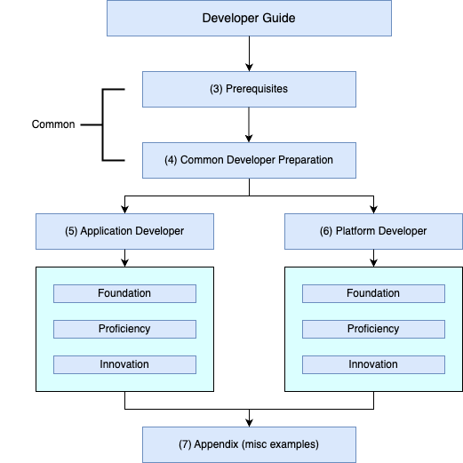<br/>

> [!NOTE]
> - When following the guide make sure to use the latest Android revision available. Revisions in Jenkins move while
>   this guide is unchanged.
> - Developers are free to choose their own path and are not limited to a single approach.
>   - They can select the labs that works best for them, or participate in both, without any restrictions or siloing.
> - There is some common setup required, outlined in the following section:
>   - [4. Common Developer Preparation](#4-common-developer-preparation)

> [!IMPORTANT]
> - Please use the latest available Android revisions when following this guide. Jenkins Android revisions may change over time, while this guide remains showing older versions.
>   - Android versions are updated regularly. Users should verify which releases are currently supported. Exercises in this guide may reference older versions; please update them to the latest supported release as appropriate.
> - When working with Cuttlefish, please be aware that the latest supported versions change frequently. The examples provided in this guide may become outdated, as <a href=https://github.com/google/android-cuttlefish/tags>tags</a> are updated regularly.
> - Some examples reference `gsutil` which is now deprecated, please replace with `gcloud storage` commands instead.

## <span style="color:#335bff">2. Table Of Contents <a name="2-table-of-contents"></a></span>

- [1. Overview](#1-overview)
- [2. Table Of Contents](#2-table-of-contents)
- [3. Prerequisites](#3-prerequisites)
  * [3.1 Horizon SDV Platform Provisioning](#3-1-horizon-sdv-platform-provisioning)
  * [3.2 Docker Image Template](#3-2-docker-image-template)
  * [3.3 Cuttlefish Instance Templates](#3-3-cuttlefish-instance-templates)
  * [3.4 Gerrit Setup](#3-4-gerrit-setup)
    * [3.4.1 User Access](#3-4-1-user-access)
      * [3.4.1.1 Add users to Administrators group](#3-4-1-1-add-users-to-administrators-group)
      * [3.4.1.2 Create User HTTP token/password](#3-4-1-2-create-user-http-token-password)
    * [3.4.2 Project Access Settings](#3-4-2-project-access-settings)
    * [3.4.3 Project Fork Creation](#3-4-3-project-fork-creation)
      * [3.4.3.1 Create the empty Horizon Gerrit repo(s)](#3-4-3-1-create-the-empty-horizon-gerrit-repos)
      * [3.4.3.2 Create forks of upstream repos](#3-4-3-2-create-forks-of-upstream-repos)
      * [3.4.3.3 Update Manifests](#3-4-3-3-update-manifests)
    * [3.4.4 Patch Android](#3-4-4-patch-android)
      * [3.4.4.1 `android-14.0.0_r30` - audio crash bug](#3-4-4-1-audio-crash-bug)
  * [3.5 Warmed Build Caches](#3-5-warmed-build-caches)
  * [3.6 Preparation](#3-6-preparation)
- [4. Common Developer Preparation](#4-common-developer-preparation)
- [5. Application Developer](#5-application-developer)
  * [5.1 Foundation](#5-1-foundation)
    * [5.1.1 Android SDK Virtual Devices](#5-1-1-android-sdk-virtual-devices)
    * [5.1.2 Cuttlefish Virtual Devices](#5-1-2-cuttlefish-virtual-devices)
    * [5.1.3 Gerrit Review - Build pipeline](#5-1-3-gerrit-review---build-pipeline)
  * [5.2 Proficiency](#5-2-proficiency)
    * [5.2.1 Gerrit Review - Test](#5-2-1-gerrit-review---test)
    * [5.2.2 Code Labs - Road Reels Application](#5-2-2-code-labs---road-reels-application)
    * [5.2.3 Boot Animation](#5-2-3-boot-animation)
  * [5.3 Innovation](#5-3-innovation)
- [6. Platform Developer](#6-platform-developer)
  * [6.1 Foundation](#6-1-foundation)
    * [6.1.1 Android Compatibility Test Suite](#6-1-1-android-compatibility-test-suite)
    * [6.1.2 Pixel Tablet](#6-1-2-pixel-tablet)
    * [6.1.3 Cuttlefish Virtual Devices](#6-1-3-cuttlefish-virtual-devices)
    * [6.1.4 Gerrit Review - Build pipeline](#6-1-4-gerrit-review---build-pipeline)
  * [6.2 Proficiency](#6-2-proficiency)
    * [6.2.1 Gerrit Review - Build pipeline](#6-2-1-gerrit-review---build-pipeline)
    * [6.2.2 Flashing Pixel Tablet](#6-2-2-flashing-pixel-tablet)
    * [6.2.3 Override make commands](#6-2-3-override-make-commands)
    * [6.2.4 Boot Animation](#6-2-4-boot-animation)
  * [6.3 Innovation](#6-3-innovation)
- [7. Appendix](#7-appendix)
  * [7.1 Android support](#7-1-android-support)
  * [7.2 Lunch Targets](#7-2-lunch-targets)
  * [7.3 Gerrit](#7-3-gerrit)
    * [7.3.1 Fork a project](#7-3-1-fork-a-project)
    * [7.3.2 Update the manifest](#7-3-2-update-the-manifest)
    * [7.3.3 Gerrit Triggers](#7-3-3-gerrit-triggers)
  * [7.4 Cuttlefish Instance Templates](#7-4-cuttlefish-instance-templates)
  * [7.5 Machine Types](#7-5-machine-types)
  * [7.6 Standalone Build and Test Scripts](#7-6-standalone-build-and-test-scripts)
  * [7.7 Debugging and Extending Build and Test Jobs](#7-7-debugging-and-extending-build-and-test-jobs)
  * [7.8 RPi Support](#7-8-rpi-support)

---

## <span style="color:#335bff">3. Prerequisites <a name="3-prerequisites"></a></span>

Before either developer can utilise the Horizon SDV platform tools, several prerequisite steps must be completed.

Summary of pre-requisite tasks:
- Horizon SDV Platform Provisioned.
  - Keycloak and Jenkins group/role access provisioned.
- Docker Image Template created from Jenkins.
- Cuttlefish Instance Templates created from Jenkins.
- Gerrit projects (code repos and manifests) provisioned ahead of time.
- Build caches warmed.
- Final platform preparation.

### <span style="color:#335bff">3.1 Horizon SDV Platform Provisioning <a name="3-1-horizon-sdv-platform-provisioning"></a></span>

For these development streams, the necessary infrastructure should have been pre-provisioned, enabling developers to immediately access the platforms and begin the tutorials.

**Prerequisite: Jenkins Access and Permissions**

To run pipeline jobs, users must have access to Jenkins and be granted permissions to access jobs in the workloads.

- Users given appropriate Keycloak Group access as per the instructions detailed in [Jenkins Access via Keycloak Groups](../../../deployment_guide.md#section-5d---jenkins-access-via-keycloak-groups), i.e. `docs/deployment_guide.md`.
- Jenkins `Role Based Strategy` permissions granted as per [Pipeline Guide](../../guides/pipeline_guide.md#prerequisites).
- Workloads are seeded/created as per [Seed Workloads](../../seed.md).

### <span style="color:#335bff">3.2 Docker Image Template <a name="3-2-docker-image-template"></a></span>
<details>
<summary>Create Docker Image Template</summary>

To build Android targets and utilise other pipeline jobs, it is mandatory to run the Docker Image Template job, which creates the Docker image that Kubernetes will use to execute the jobs on the build nodes.

- From Jenkins, Build <code>Android Workflows</code> → <code>Environment</code> → <code>Docker Image Template</code> as follows:

  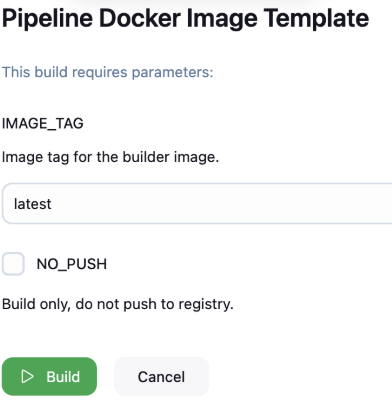<br/>
  <ul>
  <li>Deselect <code>NO_PUSH</code></li>
  <li>Select <code>Build</code></li>
  </ul>
</details>

### <span style="color:#335bff">3.3 Cuttlefish Instance Templates <a name="3-3-cuttlefish-instance-templates"></a></span>

> [!TIP]
> If there are issues observed when creating the templates, review the console logs for errors to ensure the environment
> and jobs were setup correctly.
>
> The person preparing the platform may wish to test the instance templates using `CVD Launcher` and `CTS Execution` test jobs, using the `aosp_cf` targets created by the `Warm Build Caches` job. Refer to lab exercises for details how to prepare and run those jobs.

<details>
<summary>Create Cuttlefish Instance Templates</summary>

This job generates the Google Compute Engine (GCE) instance templates required by test pipelines to provision Cuttlefish-ready and CTS-ready cloud instances. These instances are then used to launch [CVD](https://source.android.com/docs/devices/cuttlefish) and execute [CTS](https://source.android.com/docs/compatibility/cts) tests.

**Prerequisites:**

The `Docker Image Template` job must be completed before running this job.

**Parallel Execution:**

This job can be run concurrently with subsequent provisioning stages, such as `Gerrit Setup` and `Warm Build Caches`, allowing for efficient use of resources and minimising overall provisioning time.

<b>Build Cuttlefish instance template for <a href=https://github.com/google/android-cuttlefish/tree/main>main</a></b>

- From Jenkins, Build <code>Android Workflows</code> → <code>Environment</code> → <code>CF Instance Template</code> as follows:

  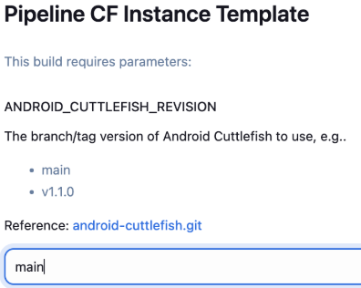<br/>
  <ul>
  <li>Set <code>ANDROID_CUTTLEFISH_REVISION</code> to <code>main</code></li>
  <li>Select <code>Build</code></li>
  </ul>

<b>Build Cuttlefish instance template for <a href=https://github.com/google/android-cuttlefish/tree/v1.1.0>v1.1.0</a> (queue it behind main)</b>

- From Jenkins, Build <code>Android Workflows</code> → <code>Environment</code> → <code>CF Instance Template</code> as follows:

  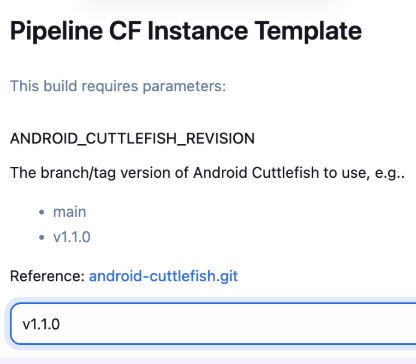
  <ul>
  <li>Set <code>ANDROID_CUTTLEFISH_REVISION</code> to <code>v1.1.0</code></li>
  <li>Select <code>Build</code></li>
  </ul>

Verify the templates have been created.
- From the Browser enter your Google Cloud Platform project welcome page, select `Compute Engine` → `Instance Templates`, and verify the two templates have been created.
  - `instance-template-cuttlefish-vm-main`
  - `instance-template-cuttlefish-vm-v110`

</details>

### <span style="color:#335bff">3.4 Gerrit Setup <a name="3-4-gerrit-setup"></a></span>

**Prerequisites:**
- Gerrit application provisioned, initialised in the Horizon platform.
- User has signed into Gerrit at least once before updating admin tasks.
- PC (Mac, Linux, Windows) or cloud instance, with [git](https://git-scm.com/book/en/v2/Getting-Started-Installing-Git) and [gcloud CLI installed](https://cloud.google.com/sdk/docs/install).
- <details><summary><code>gerrit-admin</code> password is known:</summary>
  To obtain Gerrit admin user name and password, retrieve membership credentials from fleet management, e.g.:<br/>
  <pre>
      gcloud container fleet memberships list
      gcloud container fleet memberships get-credentials sdv-cluster
  </pre>
  Retrieve username and password:<br/>
  <pre>
      kubectl get secrets -n keycloak keycloak-gerrit-admin -o json | jq -r '.data.username' | base64 -d
      kubectl get secrets -n keycloak keycloak-gerrit-admin -o json | jq -r '.data.password' | base64 -d
  </pre>
  </details>

**Parallel Execution:**

This task can be done concurrently while `CF Instance Template` job is running, minimising overall provisioning time.

#### <span style="color:#335bff">3.4.1 User Access <a name="3-4-1-user-access"></a></span>

This section describes how to add new users and create their HTTP token/password so they may work with Gerrit.

> [!IMPORTANT]
> - _All users must be members of the Administrator group._
> - _Any members of the Administrator group can add new users to that group._
>   - _Any new users need to have logged in at least once before they can be added to the Administrator group_
> - _If no option to ADD appears after you enter your email address or name, check for Browser issues:_
>   - _delete cookies in Browser, log in as yourself, then delete cookies again and log back in as <code>gerrit-admin</code>_
>   - _Try incognito_
>   - _If all else fails , reach out and team will share RESTful method._

<details>
<summary>Update User Access</summary>

##### <span style="color:#335bff">3.4.1.1 Add users to Administrators group <a name="3-4-1-1-add-users-to-administrators-group"></a></span>
- Login to Gerrit as <code>gerrit-admin</code> and associated password retrieved from keycloak secrets earlier.
- Select `BROWSE` → `Groups` → `Administrators`
- Select `Members` and add your email and any other users to the `Administrators` group:

  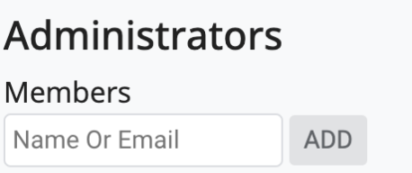<br/>

##### <span style="color:#335bff">3.4.1.2 Create User HTTP token/password <a name="3-4-1-2-create-user-http-token-password"></a></span>

In order to be able to access repos etc, a token must be created.
- Login to Gerrit as yourself (user), **not** as `gerrit-admin`.
- Select `USER`(Top Right Hand Side)→`Settings`→`HTTP Credentials`
- Select `GENERATE NEW PASSWORD`
- Note the password for later usage.
</details>

> [!IMPORTANT]
> - _All further work (in git & Gerrit) should be performed as the user, not gerrit-admin_
> - _You will be using your credentials and HTTP token/password that has been created._
>   - _How the user manages their git login/password credentials is up to them, e.g. use of git credentials, config, netrc etc, is wholly dependent on preference and perhaps company security policies._

#### <span style="color:#335bff">3.4.2 Project Access Settings<a name="3-4-2-project-access-settings"></a></span>
<details>
<summary>Update Project Access Settings</summary>

In order to create projects based on Google Android Opensource tags, there are some additional permissions required to allow the forks to be created. These permissions are set as part of `All-Projects` project (`refs/meta/config`) and for sake of this tutorial, we will use the Gerrit UI to update these settings rather than cloning and updating `refs/meta/config`.

> **NOTE**
> - the [Skip Validation](https://gerrit-review.googlesource.com/Documentation/user-upload.html#skip_validation) push option is required for projects with a large number of commits and also to retain the original committer etc.
> - The Gerrit Admin can decide when to revoke these permissions but for sake of these exercises, we leave the permissions in place.

To edit the Access options of All-Projects perform the following:

- Select `BROWSE` → `Repositories` → `All-Projects`
  - Select `Access`

    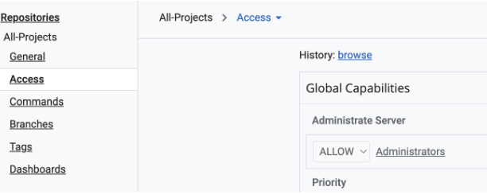

  - Click on `Edit`

    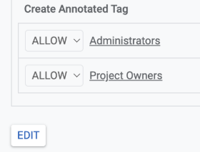

  - Add permissions `Forge Server Identity`, `Push` and `Push Merge Commit` to `Reference:refs/heads/*`
  - Navigate to the section: `Reference:refs/heads/*`
  - Select `Add permission` and select `Forge Server Identity` and `ADD`
  - In `Add group` text box, type `Administrators` and add
  - Repeat for `Push` and `Push Merge Commit`
  - Select `SAVE` at the bottom of the page to update the configuration.
</details>

#### <span style="color:#335bff">3.4.3 Project Fork Creation <a name="3-4-3-project-fork-creation"></a></span>
<details>
<summary>Create Android Project Forks</summary>

Manifests and Projects must be hosted in Gerrit in order to utilise the default Jenkins pipeline configuration.<br/>

There are a number of repositories we must fork from upstream [Google AOSP Gerrit](https://android-review.googlesource.com/q/status:open+-is:wip). The projects we currently mirror are:

- `platform/manifest`
- `platform/frameworks/native`
- `platform/packages/services/Car`
- `platform/platform_testing`
- `platform/hardware/interfaces`
- `platform/packages/apps/Car/Launcher`

In Horizon SDV Gerrit these become:
- `android/platform/manifest`
- `android/platform/frameworks/native`
- `android/platform/packages/services/Car`
- `android/platform/platform_testing`
- `android/platform/hardware/interfaces`
- `android/platform/packages/apps/Car/Launcher`

This section shows how to create and populate the mirrors on Horizon SDV Gerrit.

##### <span style="color:#335bff">3.4.3.1 Create the empty Horizon Gerrit repo(s) <a name="3-4-3-1-create-the-empty-horizon-gerrit-repos"></a></span>

- In Gerrit, Select `BROWSE` → `Repositories` → `CREATE NEW`
- Enter the `Repository Name` as per list above (e.g. `android/platform/manifest`)
- Enter the `Default Branch` : `horizon/android-14.0.0_r30`
  - This means `HEAD` will move from `master` to `horizon/android-14.0.0_r30`
  - Should you wish to, you may choose to change `HEAD` to point to a different branch.
- Set `Create Empty Commit` to `False` so we retain original history from upstream Google AOSP.

  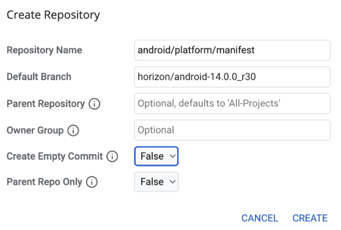

- Select `CREATE`.
- Repeat for `android/platform/frameworks/native`, `android/platform/packages/services/Car`, `android/platform/platform_testing`, `android/platform/hardware/interfaces`, `android/platform/packages/apps/Car/Launcher`

> **NOTE**
> The `android` prefix is used because Gerrit may not only host Android repos and as such we use a prefix to separate them under android workload.

##### <span style="color:#335bff">3.4.3.2 Create forks of upstream repos <a name="3-4-3-2-create-forks-of-upstream-repos"></a></span>
> **IMPORTANT**
> - Before proceeding with these exercises, please note the URLs referenced in the instructions reference an example domain.
>   - Replace `example.horizon-sdv.com` in the URLs with your domain
> - Remember to use your Horizon SDV Gerrit credentials and HTTP token/password as mentioned in earlier sections. How you manage those is entirely up to you.
<pre>
# Clone Google AOSP repo
git clone https://android.googlesource.com/platform/manifest
cd manifest
# Add Horizon SDV Gerrit remote
git remote add horizon https://example.horizon-sdv.com/gerrit/android/platform/manifest
# Create the Horizon SDV Gerrit branch from AOSP tag
git checkout -b horizon/android-14.0.0_r30 android-14.0.0_r30
git push -o skip-validation horizon horizon/android-14.0.0_r30
git checkout -b horizon/android-15.0.0_r36 android-15.0.0_r36
git push -o skip-validation horizon horizon/android-15.0.0_r36
git checkout -b horizon/android-16.0.0_r3 android-16.0.0_r3
git push -o skip-validation horizon horizon/android-16.0.0_r3
cd ..
rm -rf manifest
</pre>
<details><summary><code>platform/frameworks/native</code></summary>
<pre>
# Clone Google AOSP repo
git clone https://android.googlesource.com/platform/frameworks/native
cd native
# Add Horizon SDV Gerrit remote
git remote add horizon https://example.horizon-sdv.com/gerrit/android/platform/frameworks/native
# Create the Horizon SDV Gerrit branch from AOSP tag
git checkout -b horizon/android-14.0.0_r30 android-14.0.0_r30
git push -o skip-validation horizon horizon/android-14.0.0_r30
git checkout -b horizon/android-15.0.0_r36 android-15.0.0_r36
git push -o skip-validation horizon horizon/android-15.0.0_r36
git checkout -b horizon/android-16.0.0_r3 android-16.0.0_r3
git push -o skip-validation horizon horizon/android-16.0.0_r3
cd ..
rm -rf native
</pre>
</details>
<details><summary><code>platform/packages/services/Car</code></summary>
<pre>
# Clone Google AOSP repo
git clone https://android.googlesource.com/platform/packages/services/Car
cd Car
# Add Horizon SDV Gerrit remote
git remote add horizon https://example.horizon-sdv.com/gerrit/android/platform/packages/services/Car
# Create the Horizon SDV Gerrit branch from AOSP tag
git checkout -b horizon/android-14.0.0_r30 android-14.0.0_r30
git push -o skip-validation horizon horizon/android-14.0.0_r30
git checkout -b horizon/android-15.0.0_r36 android-15.0.0_r36
git push -o skip-validation horizon horizon/android-15.0.0_r36
git checkout -b horizon/android-16.0.0_r3 android-16.0.0_r3
git push -o skip-validation horizon horizon/android-16.0.0_r3
cd ..
rm -rf Car
</pre>
</details>
<details><summary><code>platform/platform_testing</code></summary>
<pre>
# Clone Google AOSP repo
git clone https://android.googlesource.com/platform/platform_testing
cd platform_testing
# Add Horizon SDV Gerrit remote
git remote add horizon https://example.horizon-sdv.com/gerrit/android/platform/platform_testing
# Create the Horizon SDV Gerrit branch from AOSP tag
git checkout -b horizon/android-14.0.0_r30 android-14.0.0_r30
git push -o skip-validation horizon horizon/android-14.0.0_r30
git checkout -b horizon/android-15.0.0_r36 android-15.0.0_r36
git push -o skip-validation horizon horizon/android-15.0.0_r36
git checkout -b horizon/android-16.0.0_r3 android-16.0.0_r3
git push -o skip-validation horizon horizon/android-16.0.0_r3
cd ..
rm -rf platform_testing
</pre>
</details>
<details><summary><code>platform/hardware/interfaces</code></summary>
<pre>
# Clone Google AOSP repo
git clone https://android.googlesource.com/platform/hardware/interfaces
cd interfaces
# Add Horizon SDV Gerrit remote
git remote add horizon https://example.horizon-sdv.com/gerrit/android/platform/hardware/interfaces
# Create the Horizon SDV Gerrit branch from AOSP tag
git checkout -b horizon/android-14.0.0_r30 android-14.0.0_r30
git push -o skip-validation horizon horizon/android-14.0.0_r30
git checkout -b horizon/android-15.0.0_r36 android-15.0.0_r36
git push -o skip-validation horizon horizon/android-15.0.0_r36
git checkout -b horizon/android-16.0.0_r3 android-16.0.0_r3
git push -o skip-validation horizon horizon/android-16.0.0_r3
cd ..
rm -rf interfaces
</pre>
</details>
<details><summary><code>platform/packages/apps/Car/Launcher</code></summary>
<pre>
# Clone Google AOSP repo
git clone https://android.googlesource.com/platform/packages/apps/Car/Launcher
cd Launcher
# Add Horizon SDV Gerrit remote
git remote add horizon https://example.horizon-sdv.com/gerrit/android/platform/packages/apps/Car/Launcher
# Create the Horizon SDV Gerrit branch from AOSP tag
git checkout -b horizon/android-14.0.0_r30 android-14.0.0_r30
git push -o skip-validation horizon horizon/android-14.0.0_r30
git checkout -b horizon/android-15.0.0_r36 android-15.0.0_r36
git push -o skip-validation horizon horizon/android-15.0.0_36
git checkout -b horizon/android-16.0.0_r3 android-16.0.0_r3
git push -o skip-validation horizon horizon/android-16.0.0_r3
cd ..
rm -rf Launcher
</pre>
</details>

##### <span style="color:#335bff">3.4.3.3 Update Manifests <a name="3-4-3-3-update-manifests"></a></span>
In order to use the forked repos, the Horizon SDV Gerrit manifests must be updated to reference the forked repos. We must update the
manifests remotes and forked project names.

> **IMPORTANT**
> - URLs differ per project, so do not cut and paste from this text, copy from Gerrit only.
> - Remember to use your Horizon SDV Gerrit credentials and HTTP token/password as mentioned in earlier sections. How you manage those is entirely up to you.

Clone the Horizon SDV Gerrit manifest:

- In Gerrit select `BROWSE` → `Repositories` → `android/platform/manifest`
  - Copy the `Clone with commit-msg hook`

    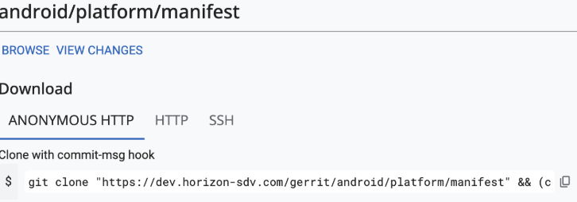

  - Clone the repo, e.g.:
  <pre>
     # Clone the manifest repo (HEAD is horizon/android-14.0.0_r30)
     git clone "https://example.horizon-sdv.com/gerrit/android/platform/manifest" && (cd "manifest" && mkdir -p `git rev-parse --git-dir`/hooks/ && curl -Lo `git rev-parse --git-dir`/hooks/commit-msg https://example.horizon-sdv.com/gerrit/tools/hooks/commit-msg && chmod +x `git rev-parse --git- dir`/hooks/commit-msg)
     cd manifest
  </pre>
  - Update `android-14.0.0_r30`
  <pre>
     git checkout horizon/android-14.0.0_r30
  </pre>
  - Update `default.xml` remotes as follows and add the `gerrit` remote and ensure the URL  matches your domain:<br/>
      ```
      <remote name="aosp"
              fetch="https://android.googlesource.com"
              review="https://android-review.googlesource.com/" />
      <remote name="gerrit"
              fetch="https://example.horizon-sdv.com/gerrit"
              review="https://example.horizon-sdv.com/gerrit/" />
      <default revision="refs/tags/android-14.0.0_r30"
               remote="aosp"
               sync-j="4" />
     ```
  - Change the following `<project path` entries: update `name` to include `android` prefix and add `gerrit` `remote` and `revision` in `default.xml`, e.g.:
      ```
      <project path="frameworks/native" name="android/platform/frameworks/native" groups="pdk" remote="gerrit" revision="horizon/android-14.0.0_r30" />
      <project path="hardware/interfaces" name="android/platform/hardware/interfaces" groups="pdk,sysui- studio" remote="gerrit" revision="horizon/android-14.0.0_r30" />
      <project path="packages/apps/Car/Launcher" name="android/platform/packages/apps/Car/Launcher" groups="pdk-fs" remote="gerrit" revision="horizon/android-14.0.0_r30" />
      <project path="packages/services/Car" name="android/platform/packages/services/Car" groups="pdk-cw- fs,pdk-fs" remote="gerrit" revision="horizon/android-14.0.0_r30" />
      <project path="platform_testing" name="android/platform/platform_testing" groups="pdk-fs,pdk-cw- fs,cts,sysui-studio" remote="gerrit" revision="horizon/android-14.0.0_r30" />
      ```
  - Commit: `git commit -am "Update android-14.0.0_r30 manifest"`
  - Update commit-id: `git commit --amend --no-edit`
  - Push for review: `git push origin HEAD:refs/for/horizon/android-14.0.0_r30`
  - Review and Submit change in Gerrit:
    - In Gerrit, select `CHANGES` → `OPEN` and click on the change or open the CLI link reported in the console after `push`.
    - Review and submit the change: `REPLY` → `CODE-REVIEW+2` → `SUBMIT` → `CONTINUE`

Repeat the steps for the following branches:

<details><summary><code>android-15.0.0_r36</code></summary>
<ul>
<li>Update <code>android-15.0.0_r36</code></li>
  <pre>
     git checkout horizon/android-15.0.0_r36</pre>
<li>Update <code>default.xml</code> remotes as follows and add the <code>gerrit</code> remote and ensure the URL  matches your domain:</li>
  <pre>
      &lt;remote name="aosp"
              fetch="https://android.googlesource.com"
              review="https://android-review.googlesource.com/" /&gt;
      &lt;remote name="gerrit"
              fetch="https://example.horizon-sdv.com/gerrit"
              review="https://example.horizon-sdv.com/gerrit/" /&gt;
      &lt;default revision="refs/tags/android-15.0.0_r36"
               remote="aosp"
               sync-j="4" /&gt; </pre>
<li>Change the following <code>&lt;project path</code> entries: update <code>name</code> to include <code>android</code> prefix and add <code>gerrit</code> <code>remote</code> and <code>revision</code> in <code>default.xml</code>, e.g.:</li>
<pre><code>&lt;project path="frameworks/native" name="android/platform/frameworks/native" groups="pdk" remote="gerrit" revision="horizon/android-15.0.0_r36" /&gt;
&lt;project path="hardware/interfaces" name="android/platform/hardware/interfaces" groups="pdk,sysui- studio" remote="gerrit" revision="horizon/android-15.0.0_r36" /&gt;
&lt;project path="packages/apps/Car/Launcher" name="android/platform/packages/apps/Car/Launcher" groups="pdk-fs" remote="gerrit" revision="horizon/android-15.0.0_r36" /&gt;
&lt;project path="packages/services/Car" name="android/platform/packages/services/Car" groups="pdk-cw- fs,pdk-fs" remote="gerrit" revision="horizon/android-15.0.0_r36" /&gt;
&lt;project path="platform_testing" name="android/platform/platform_testing" groups="pdk-fs,pdk-cw- fs,cts,sysui-studio" remote="gerrit" revision="horizon/android-15.0.0_r36" /&gt;
</code></pre>
<li>Commit: <code>git commit -am "Update android-15.0.0_r36 manifest"</code></li>
<li>Update commit-id: <code>git commit --amend --no-edit</code></li>
<li>Push for review: <code>git push origin HEAD:refs/for/horizon/android-15.0.0_r36</code></li>
<li>Review and Submit change in Gerrit:</li>
<ul><li>In Gerrit, select <code>CHANGES</code> → <code>OPEN</code> and click on the change or open the CLI link reported in the console after <code>push</code>.</li>
<li>Review and submit the change: <code>REPLY</code> → <code>CODE-REVIEW+2</code> → <code>SUBMIT</code> → <code>CONTINUE</code></li></ul></ul>
</details>

<details><summary><code>android-16.0.0_r3</code></summary>
<ul>
<li>Update <code>android-16.0.0_r3</code></li>
  <pre>
     git checkout horizon/android-16.0.0_r3</pre>
<li>Update <code>default.xml</code> remotes as follows and add the <code>gerrit</code> remote and ensure the URL  matches your domain:</li>
  <pre>
      &lt;remote name="aosp"
              fetch="https://android.googlesource.com"
              review="https://android-review.googlesource.com/" /&gt;
      &lt;remote name="gerrit"
              fetch="https://example.horizon-sdv.com/gerrit"
              review="https://example.horizon-sdv.com/gerrit/" /&gt;
      &lt;default revision="refs/tags/android-16.0.0_r3"
               remote="aosp"
               sync-j="4" /&gt; </pre>
<li>Change the following <code>&lt;project path</code> entries: update <code>name</code> to include <code>android</code> prefix and add <code>gerrit</code> <code>remote</code> and <code>revision</code> in <code>default.xml</code>, e.g.:</li>
<pre><code>&lt;project path="frameworks/native" name="android/platform/frameworks/native" groups="pdk" remote="gerrit" revision="horizon/android-16.0.0_r3" /&gt;
&lt;project path="hardware/interfaces" name="android/platform/hardware/interfaces" groups="pdk,sysui- studio" remote="gerrit" revision="horizon/android-16.0.0_r3" /&gt;
&lt;project path="packages/apps/Car/Launcher" name="android/platform/packages/apps/Car/Launcher" groups="pdk-fs" remote="gerrit" revision="horizon/android-16.0.0_r3" /&gt;
&lt;project path="packages/services/Car" name="android/platform/packages/services/Car" groups="pdk-cw- fs,pdk-fs" remote="gerrit" revision="horizon/android-16.0.0_r3" /&gt;
&lt;project path="platform_testing" name="android/platform/platform_testing" groups="pdk-fs,pdk-cw- fs,cts,sysui-studio" remote="gerrit" revision="horizon/android-16.0.0_r2" /&gt;
</code></pre>
<li>Commit: <code>git commit -am "Update android-16.0.0_r3 manifest"</code></li>
<li>Update commit-id: <code>git commit --amend --no-edit</code></li>
<li>Push for review: <code>git push origin HEAD:refs/for/horizon/android-16.0.0_r3</code></li>
<li>Review and Submit change in Gerrit:</li>
<ul><li>In Gerrit, select <code>CHANGES</code> → <code>OPEN</code> and click on the change or open the CLI link reported in the console after <code>push</code>.</li>
<li>Review and submit the change: <code>REPLY</code> → <code>CODE-REVIEW+2</code> → <code>SUBMIT</code> → <code>CONTINUE</code></li></ul></ul>
</details>
</details>

#### <span style="color:#335bff">3.4.4 Patch Android<a name="3-4-4-patch-android"></a></span>

<details>
<summary>Apply Android Patches</summary>

##### <span style="color:#335bff">3.4.4.1 `android-14.0.0_r30` - audio crash bug<a name="3-4-4-1-audio-crash-bug"></a></span>

This patch is already included in later releases, but simpler to include here and push than users having to manually include the patch in builds.

**Pixel Audio Patch (`android-14.0.0_r30`)**
  ```
  # Clone android/platform/packages/services/Car
  git clone https://example.horizon-sdv.com/gerrit/android/platform/packages/services/Car -b horizon/android-14.0.0_r30
  cd Car

  # FETCH upstream patch
  git fetch https://android.googlesource.com/platform/packages/services/Car refs/changes/83/3037383/2 && git cherry-pick FETCH_HEAD
  # Push to Horizon SDV Gerrit repo
  git push origin horizon/android-14.0.0_r30
  cd -
  rm -rf Car
  ```

</details>

> [!IMPORTANT]
> - Before proceeding with these exercises, please note the URLs referenced in the instructions reference an example domain.
>   - Replace `example.horizon-sdv.com` in the URLs with your domain


### <span style="color:#335bff">3.5 Warmed Build Caches<a name="3-5-warmed-build-caches"></a></span>

<details>
<summary>Prime Build Caches</summary>

This job is provided as an aid for improving on build times by pre-warming the build caches, i.e. the persistent volumes, ahead of time.
It does so by running a number of standard builds against the defined manifest and revision.

**Prerequisites:**

- The `Docker Image Template` job must be completed before running this job.
- Gerrit Setup must be completed before running this job.

**Parallel Execution:**

This task can be done concurrently while `CF Instance Template` job is running, minimising overall provisioning time.

- From Jenkins, Build <code>Android Workflows</code> → <code>Environment</code> → <code>Warm Build Caches</code> as follows:

  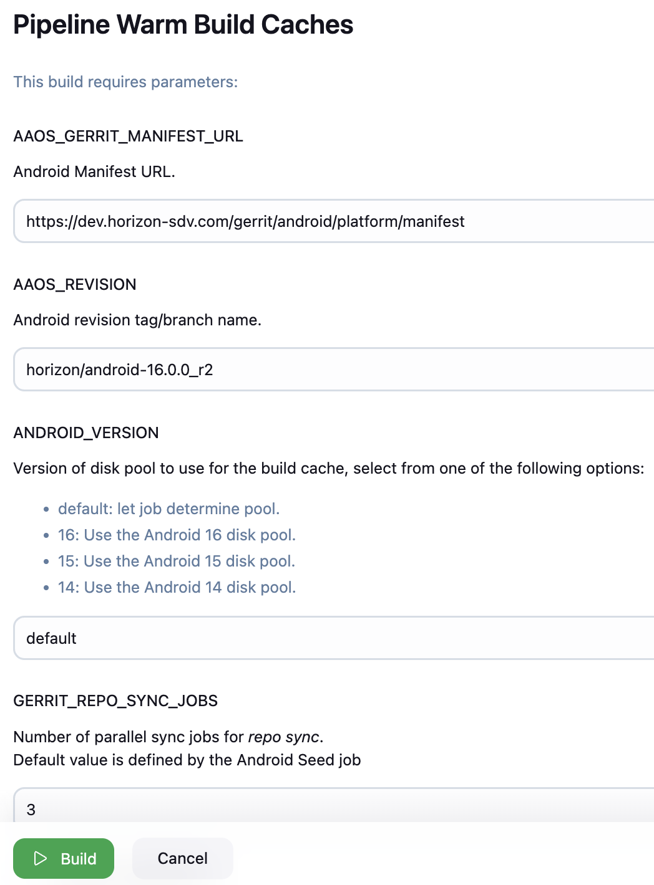

  <ul>
  <li>Accept default <code>ANDROID_MANIFEST_URL</code> (URL domain will show that of your environment)</code></li>
  <li>Accept default <code>ANDROID_REVISION</code></li>
  <li>Select <code>Build</code></li>
  <li>Repeat job 10 times: </li>
  <ul><li>Repeat the job immediately to ensure they run in parallel (<code>Build with Parameters</code> and use the same defaults).</li>
  <li>In order to reduce lab build times, this will create 10 x 2TB pd-balanced persistent volumes pre-warmed with the default builds .</li>
  <li>Decision on number of persistent volumes depends on how many parallel builds you may allow across the team. Always apply 25% extra PVs to number of builds to ensure there is always some headroom.</li></ul>
 </ul>

</details>

### <span style="color:#335bff">3.6 Preparation<a name="3-6-preparation"></a></span>

Users must be given access to their respective GCP Project, but also:

- All pre-requisites prior to this section completed ahead of time.
- Users must have appropriate roles set to access Google Cloud Storage buckets for their project, for retrieval of build artifacts.
- Users are provided an overview of GCP, authentication/login and gcloud CLI installation and usage ahead of break out into team tutorial sessions.
- Users added to Keycloak so they may access Gerrit, Jenkins and MTK Connect
- Users added to Administrator group in Gerrit so they may work with code review system.

- Hardware Platforms available (Pixel Tablets)

> [!IMPORTANT]
> - Pixel Tablets pre-provisioned (known good)
>   - Either direct laptop USB connection or demonstrate MTK Connect and the agent capability for remote connection.
>   - These lab exercises only cover direct USB connection.

---

## <span style="color:#335bff">4. Common Developer Preparation<a name="4-common-developer-preparation"></a></span>
- PC (Mac, Linux, Windows) with [git](https://git-scm.com/book/en/v2/Getting-Started-Installing-Git) and [gcloud CLI](https://cloud.google.com/sdk/docs/install) installed.
- PC with `adb` and `fastboot` installed in order to utilise the project tooling (Cuttlefish and Hardware platforms):
  - [Android Studio](https://developer.android.com/studio/install) installed (minimal requirement for application developers)
  - Alternatively, Google [platform-tools](https://developer.android.com/tools/releases/platform-tools) installed.
  - Windows users will need [win-usb](https://developer.android.com/studio/run/win-usb) to use `adb` with Hardware via USB.
- Access to their Google Cloud Platform project (assumes GCP project and tooling was already setup ahead of time)
  - Users added to keycloak so they may access the tools.
  - Users can access their Horizon SDV landing page, and access the tools in the browser:
    - Gerrit, Jenkins and MTK Connect
- User has been added as a member of Gerrit Administrator group


> [!IMPORTANT]
> - **Multiple users** will be using the platform in parallel so it is important each user takes note of which jobs is 'theirs'; to facilitate this, all jobs descriptions show the user that kicked off the job.
>
> - Android Studio's ***Android Emulator*** is used in these exercises to verify the target images created using the pipeline build jobs. With the exception of section 5.2.2 (Road Reels Application), Android Studio itself should not be used to perform builds or to clone repos.

---

## <span style="color:#335bff">5. Application Developer<a name="5-application-developer"></a></span>
The lab exercises are organised into three levels:

- **Foundation** (Objective: Gain a basic understanding of the platform)
- **Proficiency** (Objective: Intermediate Training, building on foundational knowledge, this training provides additional guidance on leveraging advanced features of the platform.)
- **Innovation** (Objective: Developers have the flexibility to explore and experiment with the platform as they see fit, with the expectation that they will provide feedback to the broader team, helping to shape and improve the platform.)

> [!IMPORTANT]
> - Before proceeding with these exercises, please note the URLs referenced in the instructions reference an example domain.
>   - Replace `example.horizon-sdv.com` in the URLs with your domain

### <span style="color:#335bff">5.1 Foundation<a name="5-1-foundation"></a></span>
The objective of this set of lab exercises is to gain a basic understanding of the Horizon SDV platform.
It will demonstrate the following:
- Building Android Virtual Device builds for use with Android Studio's Android Emulator.
- Building Android Cuttlefish Virtual Devices for use with the Cuttlefish host platform and verifying through the use of MTK Connect.

#### <span style="color:#335bff">5.1.1 Android SDK Virtual Devices<a name="5-1-1-android-sdk-virtual-devices"></a></span>
**Learning Objective**

By completing this exercise, you will gain hands-on experience in building and testing SDK AVD targets and verifying their functionality with Android Studio's Android Emulator.

<details><summary><b>Lab Exercise</b></summary>

___

**_Create the SDK AVD target:_**

- Open Jenkins Dashboard (e.g. https://example.horizon-sdv.com/jenkins/) and navigate to AAOS Builder pipeline job to prepare build targets that will be used in this exercise.
- Select `Android Workflows` → `Builds` → `AAOS Builder` → `Build with Parameters` and define the `AAOS_LUNCH_TARGET` and select `Build`

  - `sdk_car_x86_64-bp3a-userdebug` or `sdk_car_arm64-bp3a-userdebug` (choose based on you local PC architecture)

    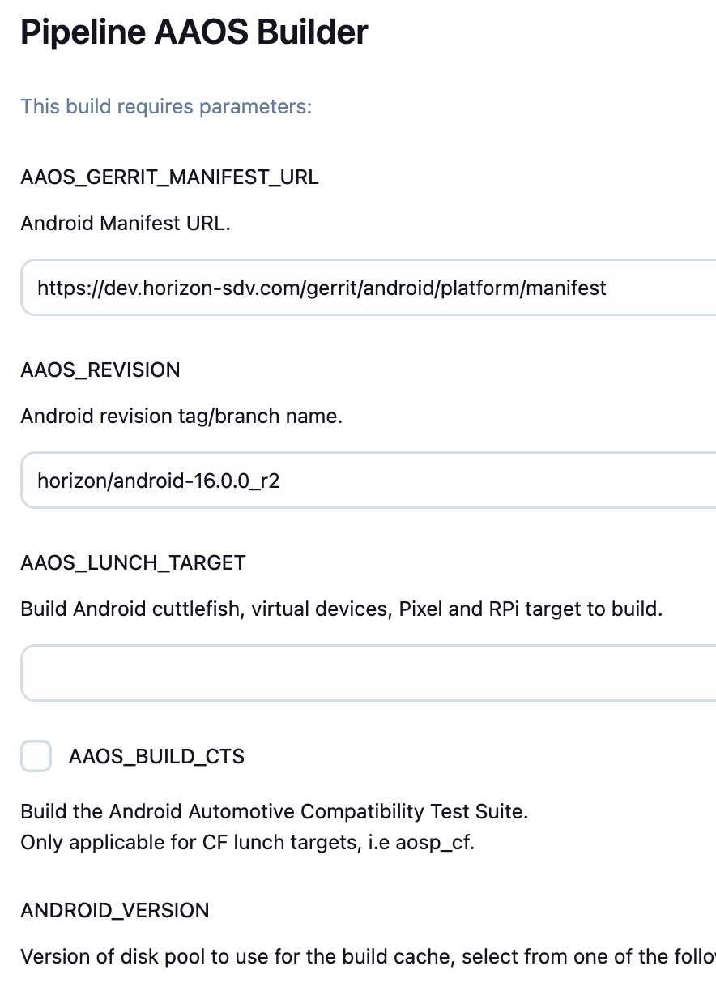

  - To identify your job within the pipeline, refer to the Builds summary section. This section provides a concise description of each build, i.e.:
    - The target and branch built.
    - Who ran the build job

      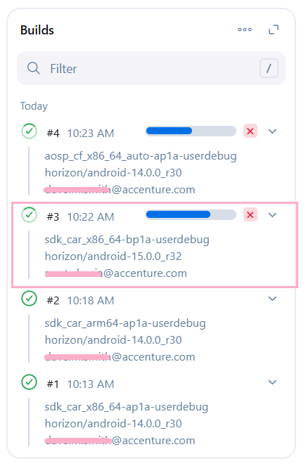

  - When build completes, the job will show the artifacts it has stored. These help the user locate the build artifacts within the Google Cloud Storage bucket.

    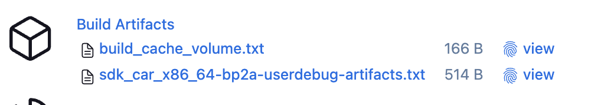

  - Open the `sdk_car_<ARCH>-userdebug-artifacts.txt` which will show you how to retrieve the artifacts, e.g.

    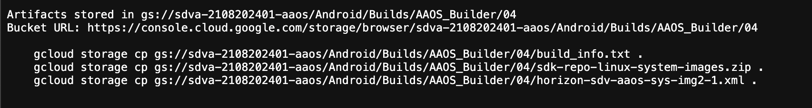

  - Using `gcloud storage cp` to download the `sdk-repo-linux-system-images.zip` images and `horizon-sdv-aaos-sys-img2-1.xml` addon files exactly as stated in your artifact file (or just copy the lines) and store for later.

The follow on section should be second nature to most but we will explain for those that have not used Android Studio before with such virtual devices. It will also serve well for later sections of this tutorial session.

**_Install the Virtual Device In Android Studio:_**
- Launch Android Studio 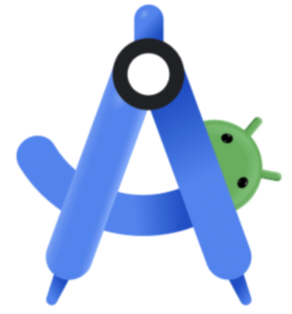 and Open the SDK Manager:
  - If you don’t have a project at this time, select the  (three vertical dots on Top Right Hand side) from the `Welcome To Android Studio` menu and select `SDK Manager`.
  - If you have a project, open, then select from Top Level `Tools` → `SDK Manager`

    

    - Alternatively open from the Settings menu :

      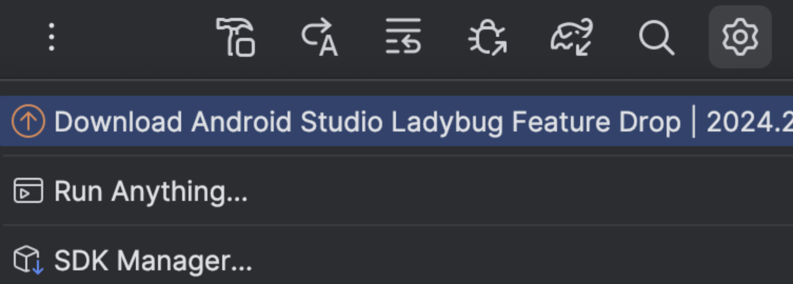

  - Select `Languages & Frameworks` → `Android SDK` → `SDK Update Sites`:

    

  - Select `+` to add your virtual device images/addon downloaded from previous `sdk_car_<ARCH>-userdebug` build.

    - Find your addon file `horizon-sdv-aaos-sys-img2-1.xml` and define URL: using `file:///`, e.g.

      `file:///Users/dave.m.smith/horizon-sdv/horizon-sdv-aaos-sys-img2-1.xml` and select `OK` and in `Settings` select `Apply`

      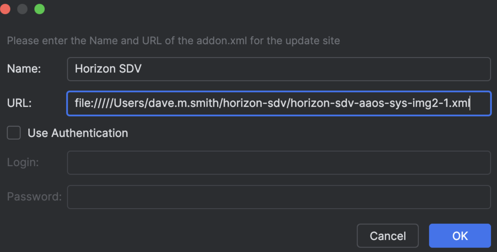

  - From `Languages & Frameworks` → `Android SDK` → `SDK Platforms` select `Show Package Details`.
    - _Previous build was Android 14 API 34 ('Upside Down Cake') so scroll down and look for an entry that starts with `Horizon SDV AAOS - Android/Builds/AAOS Builder-<build number>` - name is derived from the build that created it, so build number will match the Jenkins build job number._

      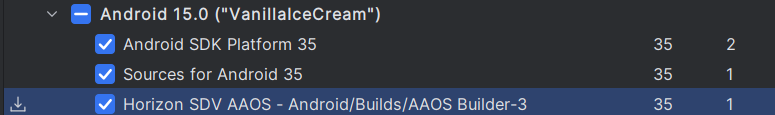

    - Select `OK` and in `Confirm Change` select `OK` to install.

      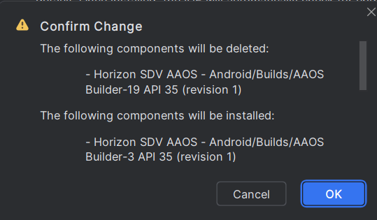

    - Wait for `SDK Component Installer` to complete and select `Finish`

**_Verify the Device:_**

- Open the Device Manager:
  - If you don’t have a project at this time, select the  (three vertical dots on Top Right Hand side) from the `Welcome To Android Studio` menu and select `Virtual Device Manager`.
  - If you have a project, open, then select from Top Level `Tools` → `Device Manager`.
  - Select `+` sign and `Create Virtual Device` and in `Select Hardware`, select `Automotive` → `Automotive (1024p landscape)` and select `Next`.

    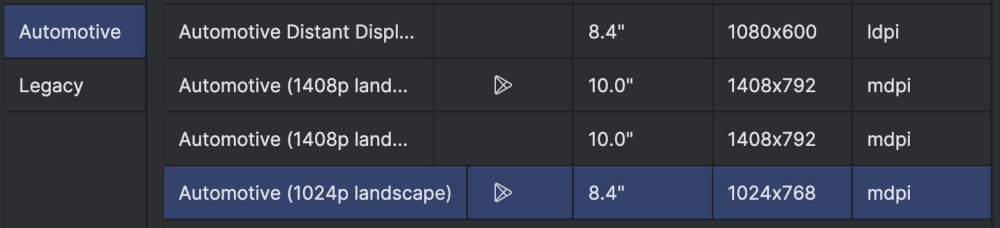

  - `System Image` should show the `Android 15.0 (Horizon SDV)` target image, select it and select `Next`
  - If you wish, change the `AVD Name` within `Verify Configuration`.
  - The Virtual Device is now available to use:

    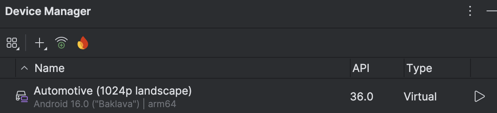

  - User may now run the device  and should see their device boot

    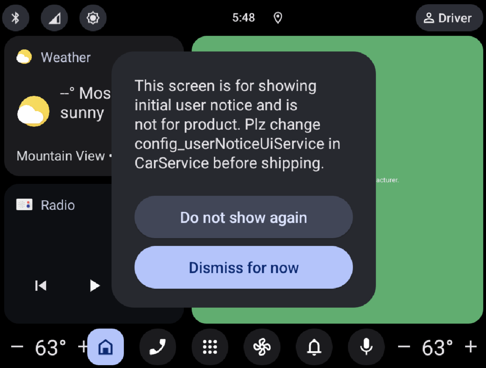<br/><br/>

___

</details><br/>

#### <span style="color:#335bff">5.1.2 Cuttlefish Virtual Devices<a name="5-1-2-cuttlefish-virtual-devices"></a></span>

**Learning Objective**

Upon completing this exercise, you will acquire practical skills in building and testing Cuttlefish AVD targets, validating their functionality on Cuttlefish host virtual machine instances, and verifying and interacting with the UI from MTK Connect.

<details><summary><b>Lab Exercise</b></summary>

___

Application developers may not use Cuttlefish to any great extent, but this lab exercise is important for later sections to demonstrate how users may install Android Package Kits (APK) on Cuttlefish devices with the Horizon SDV platform.

**_Create Cuttlefish Virtual Device target:_**

- Open Jenkins Dashboard (e.g. https://example.horizon-sdv.com/jenkins/) and navigate to AAOS Builder pipeline job to prepare build targets that will be used in this lab exercise.
- Select `Android Workflows` → `Builds` → `AAOS Builder` → `Build with Parameters` and define the `AAOS_LUNCH_TARGET` as `aosp_cf_x86_64_auto-bp3a-userdebug` and select `Build`

  - When the build completes, the job will show the artifacts it has stored. These help the user locate the build artifacts within the
Google Cloud Storage bucket for use with testing CF Virtual Devices and connecting to the device through Android Studio.  e.g.

    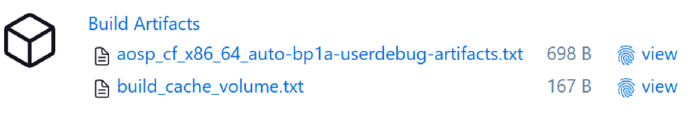

  - Open the `aosp_cf_x86_64_auto-bp3a-userdebug-artifacts.txt` which will show you were the artfifacts are stored, e.g.

    

    - Note the storage location, e.g. `gs://sdva-2108202401-aaos/Android/Builds/AAOS_Builder/45` you will need that for later in the lab exercise. There is no need to download these artifacts.
  - Now we have built the Cuttlefish virtual device images and host platform packages, we can verify the device on a cuttlefish ready host platform VM and interact with it via MTK Connect.

**_Launch Cuttlefish Virtual Device:_**

- Select `Android Workflows` → `Tests` → `CVD Launcher`
  - This will require the Google Cloud Storage bucket URL you saved from the Android Build section where you built the Cuttlefish Virtual devices.
  - Select `Build with Parameters` and define the `CUTTLEFISH_DOWNLOAD_URL` with the URL you saved previously in this lab, enable `CUTTLEFISH_INSTALL_WIFI` and define the time to keep the instance alive, `CUTTLEFISH_KEEP_ALIVE_TIME` and select `Build`, e.g.

    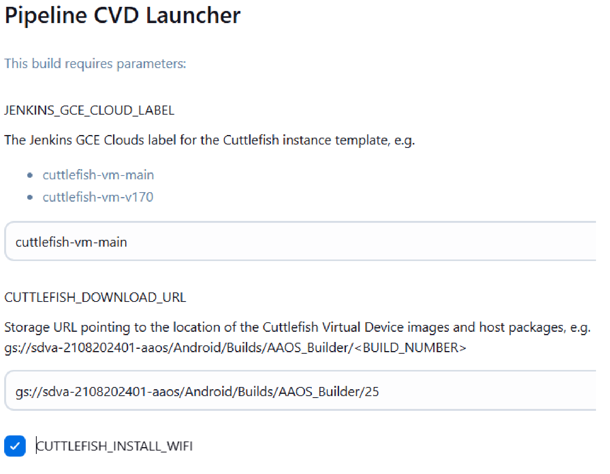<br/>
    - Note: `CUTTLEFISH_DOWNLOAD_URL` is the path and not a file, ensure you paste the correct URL from your prior CF build.<br/>

    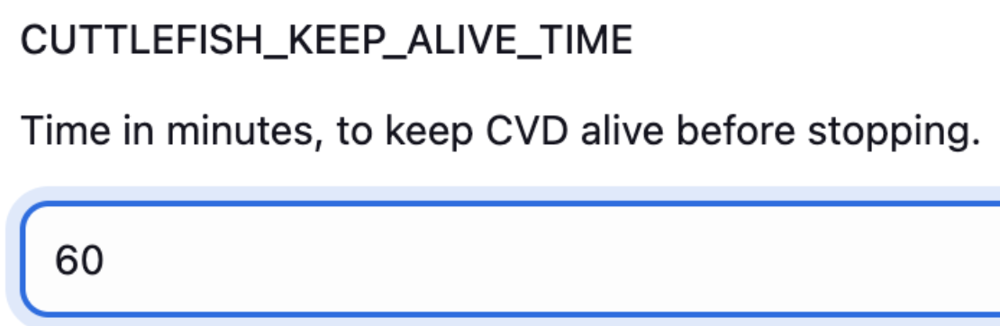<br/>
    - Note: `CUTTLEFISH_KEEP_ALIVE_TIME`, only select for as long as you may wish to run the session, instances cost money

  - Wait for job to enter the `Keep Devices Alive` stage and then we can use MTK Connect to verify the device

**_Verify in MTK Connect Application:_**
- Open MTK Connect application from landing page (link in jenkins description of CVD Launcher job), or the URL reported within the console log for the CVD Launcher job.
  - Select `TESTBENCHES` option within the application:

    

  - Find your Testbench, select it and then select a device, in this case it’s AAOS 1, e.g.

    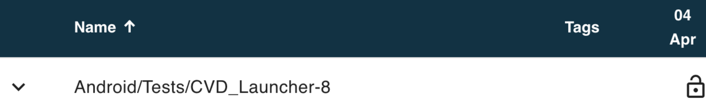

    

    > **Note:** 
    > - Testbench should be identifiable from your CVD Launcher job name and number, e.g. `Android/Tests/CVD_Launcher-8`
    > - Refresh the browser page if your testbench has yet to appear.
    > - The console log provides a summary of the MTK Connect URL and Testbench name.

  - Select the duration you wish to `Book the device` (select the padlock symbol), e.g.

    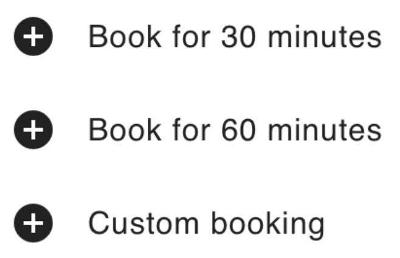

  - You can now use MTK Connect to interact with the device through the UI:

    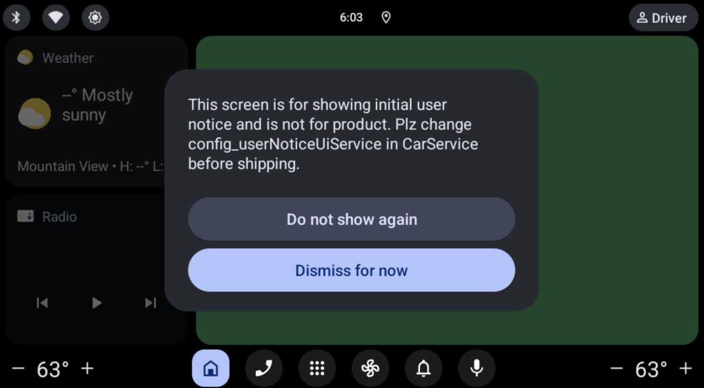

  - Select the three dots symbol and you can use `adb` or connect directly to the cuttlefish host platform.

  - Familiarise yourself with the `CVD Launcher` job and `MTK Connect` because we will be using this in later exercises.
___

</details><br/>

#### <span style="color:#335bff">5.1.3 Gerrit Review - Build pipeline<a id="5-1-3-gerrit-review---build-pipeline"></a></span>

**Learning Objective**

Upon completing this exercise, you will gain hands-on experience in making code changes, pushing for review in Gerrit, automated triggering of the Gerrit build pipeline job, and verifying the build targets using the tools available, including Android Studio's Android Emulator, Cuttlefish host VMs, and MTK Connect.

> [!NOTE]
> This example provides a basic change to guarantee that the Gerrit build pipeline is triggered, builds are successful and successful result is reported back to Gerrit in review comments and the `VERIFIED` label.
> Gerrit and the Jenkins build pipeline is for demonstration purposes only, it builds the following targets:
> - `sdk_car_x86_64`
> - `sdk_car_arm64`
> - `aosp_cf_x86_64_auto`
> - `aosp_tangorpro_car`
>
> and runs a simple single module CTS test module. During each stage of the build, the jobs stores the artifact file for each target showing where to retrieve the build artifacts for test purposes. You may choose to use those targets before the pipeline completes or wait until the full pipeline job completes successfully.
>
> Please retain the repo for later exercises.

<details><summary><b>Lab Exercise</b></summary>

___

Make a code change to the `platform/packages/apps/Car/Launcher` repo and stage the change in Gerrit Code Review.

Cloning / editing of code should be performed as per usual methods - it is not intended that this be done in Android Studio.

**_Clone Repo:_**

> **Important:**
> - URLs differ per project, so do not cut and paste from this text, copy from Gerrit only.
> - Remember to use your Horizon SDV Gerrit credentials and HTTP token/password as mentioned in earlier sections. How you manage those is entirely up to you.

- Open Gerrit (e.g. https://example.horizon-sdv.com/gerrit/) and navigate to the repositories area.
- Clone the `android/platform/packages/apps/Car/Launcher` repo
  - `Gerrit` → `BROWSE` → `Repositories` → `android/platform/packages/apps/Car/Launcher`
    - Copy the `Clone with commit-msg hook` and start clone, e.g.
    ```
     git clone "https://example.horizon-sdv.com/gerrit/android/platform/packages/apps/Car/Launcher" && (cd "Launcher" && mkdir -p git rev-parse --git-dir/hooks/ && curl -Lo git rev-parse --git-dir/hooks/commit-msg https://example.horizon-sdv.com/gerrit/tools/hooks/commit-msg && chmod +x git rev-parse --git-dir/hooks/commit-msg)
     ```
**_Modify the code and push to Gerrit:_**
- Open `app/res/values/strings.xml`, find the string labelled `weather_app_name` and update the value e.g.:

  `<string name="weather_app_name">Horizon-SDV Weather</string>`

  - Feel free to modify any code you feel comfortable in updating.

- Save and push the change for review:
  - Commit: `git commit -am "Car Launcher weather app update"`
  - Update Change ID if one was not automatically generated in your commit: `git commit --amend --no-edit`
  - Push for Review: `git push origin HEAD:refs/for/horizon/android-16.0.0_r3`
    - The remote should report success and provide a link back to the Gerrit review, e.g.
      - `https://example.horizon-sdv.com/gerrit/c/android/platform/packages/apps/Car/Launcher/+/182 Car Launcher weather app update [NEW]`

- The Gerrit change triggers the Gerrit build job in Jenkins:
  - Open the review URL in Gerrit and look for Gerrit build job, e.g.

    

  - Open Jenkins or access the build from the URL in the Gerrit comments.

- Build should run and Gerrit will receive a `VERIFIED` label vote as to whether successful.

**_Monitor the build:_**
- Within Jenkins application, `Android Workflows` → `Builds` → `Gerrit`
- Your job will be identifiable under the `Builds` and `Stage View` sections by the name of the project, Gerrit Change ID and Patchset number e.g.

  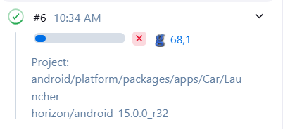

  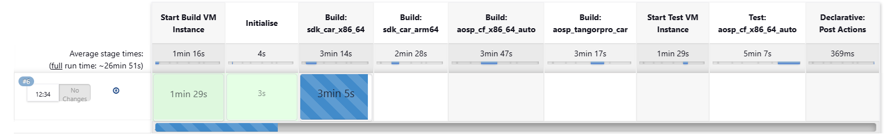

- The Gerrit builder creates the artifact summaries in Jenkins to help identify the bucket URL to retrieve the build artifacts required for verification/test, e.g.

  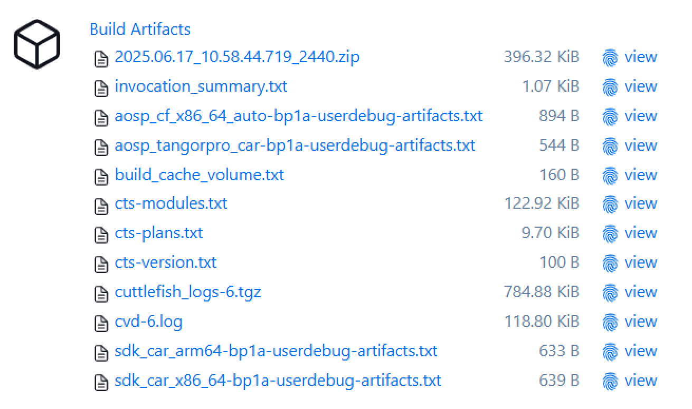

  - Pick the artifact file for the target application that suits your test environment: `sdk_car_xxx` for Android Emulator, `aosp_cf_x86_64_xxx` for Cuttlefish Virtual Devices. Note the GCS storage location as per previous foundation exercises.

</details><br/>

---

### <span style="color:#335bff">5.2 Proficiency<a name="5-2-proficiency"></a></span>

The objective of this set of lab exercises is to build upon the foundational knowledge of the Horizon SDV platform. It provides guidance to leverage more advanced features of the platform.

It will demonstrate the following:
- Build and test a change to the Android Car Launcher application within Horizon SDV platform.
- Build and test a parked app for Android Automotive OS based , i.e. [Road Reels](https://developer.android.com/codelabs/build-a-parked-app?hl=en#0) application and deploying the application to the Cuttlefish virtual device via MTK Connect tunnel interface.

From this point forward, the exercises will provide less guidance and assume a higher level of independence. If needed, refer back to the
foundational exercises for review and clarification.

#### <span style="color:#335bff">5.2.1 Gerrit Review - Test<a name="5-2-1-gerrit-review---test"></a></span>

**Learning Objective**

This exercise continues the lab from the previous section and builds upon the Car Launcher Weather app.

<details><summary><b>Lab Exercise</b></summary>

___

**_Verify the change:_**

We will verify that the change made to the Car Launcher Weather app, is visible in both Android Emulator and MTK Connect (Cuttlefish Virtual Device). Ensure the application has updated as to you expectated, e.g. Weather app name.

> Note: users should uninstall the previous Virtual Device using
> - `Android Studio` → `Virtual Device Manager` → 3 dots on device row → `Delete` → `Confirm`
> - `Android Studio` → `SDK Manager` → `Languages & Frameworks` → `Android SDK` → `SDK Platforms` → untick the previous SDK you installed → `Apply`
> - `Android Studio` → `SDK Manager` → `Languages & Frameworks` → `Android SDK` → `SDK Update Sites` → tick the previous entry you made → `minus` sign → `Ok`

Once uninstalled, then install the device add-on and system images.

- **Android Studio Virtual Device**
  - Repeat the steps from previous exercise to install the virtual device image and add-ons in Android Studio, create and run the device.
  - Note: the change in Weather app name.

    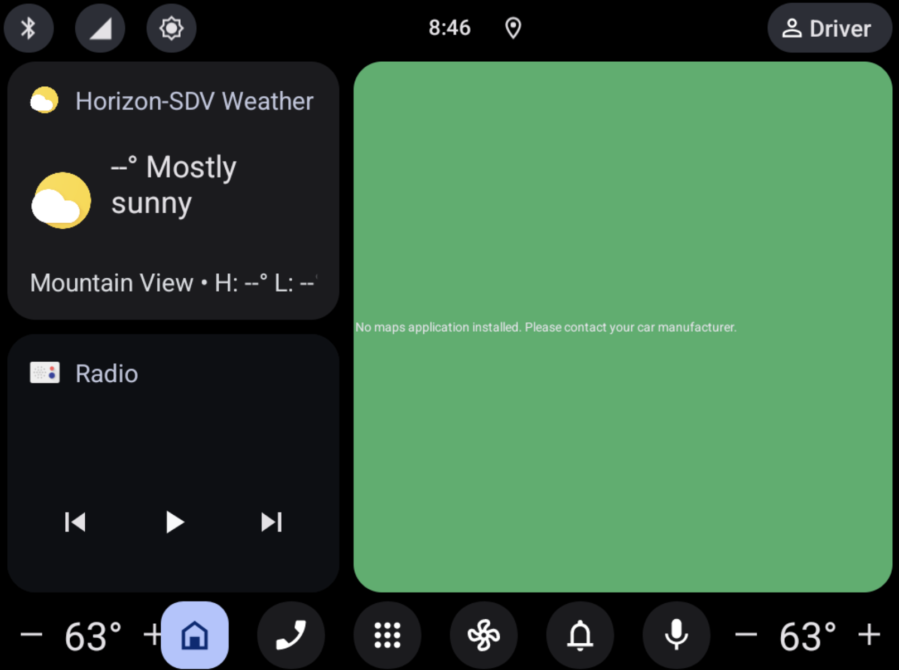

  - Retain the device for later lab exercises

- **Cuttlefish Virtual Device**
  - Repeat the steps from previous exercises to run `CVD Launcher`, remembering to use the artifact URL that contains the change made for this exercise, e.g. below shows the Gerrit artifact but also remember to define `CUTTLEFISH_KEEP_ALIVE_TIME` to suit your needs.
  - From MTK Connect, check the application was updated correctly, e.g.

    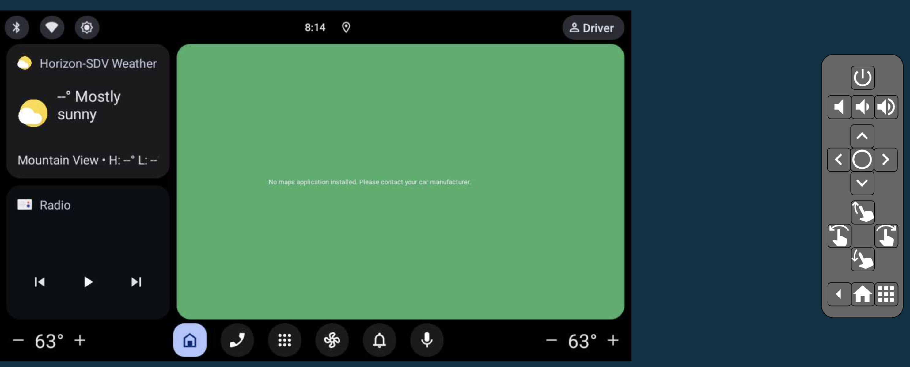

  - Retain the device for later lab exercises
___

</details><br/>

#### <span style="color:#335bff">5.2.2 Code Labs - Road Reels Application<a name="5-2-2-code-labs---road-reels-application"></a></span>

**Learning Objective**

This lab builds upon the Google CodeLab ["Build and test a parked app for Android Automotive OS"](https://developer.android.com/codelabs/build-a-parked-app?hl=en#0) (Road Reels media application lab).
While we won't cover all aspects of the original lab, we'll have you follow the Google CodeLab steps with some modifications.

Specifically, we'll replace the following sections:
- Section 4: Run the app in the Android Automotive OS emulator

Instead, you'll complete the following objectives:
1. Run the application on the Horizon SDV Android Studio Virtual device
2. Deploy the Android Package Kit (APK) to the Cuttlefish virtual device via MTK Connect tunnel application and view in Android Studio

<details><summary><b>Lab Exercise</b></summary>

___

> **Note:**
> We will be using the system images, virtual devices we created in the previous lab exercises together with the knowledge gained from those and hence we avoid duplication as much as possible in the lab exercises.

**_Road Reels Application:_**

Open [Build and test a parked app for Android Automotive OS](https://developer.android.com/codelabs/build-a-parked-app?hl=en#1) in your Browser and follow the instructions up to Section 4: Run the app in the Android Automotive OS emulator, i.e.
- ```git clone https://github.com/android/car-codelabs.git```
- Open Android Studio and import project: `build-a-parked-app/start`
  - You may choose to use `build-a-parked-app/end` which includes the solution code, but for sake of this exercise we are more interested in proving the application on the Horizon SDV virtual device targets.
- See the device created in the previous lab exercise and skip:
  - Install the Automotive with Play Store System images
  - Create an Android Automotive OS Android Virtual Device
- Follow the remaining instructions, i.e. choose the Horizon SDV device and run the app and wait for Road Reels to start, e.g.

  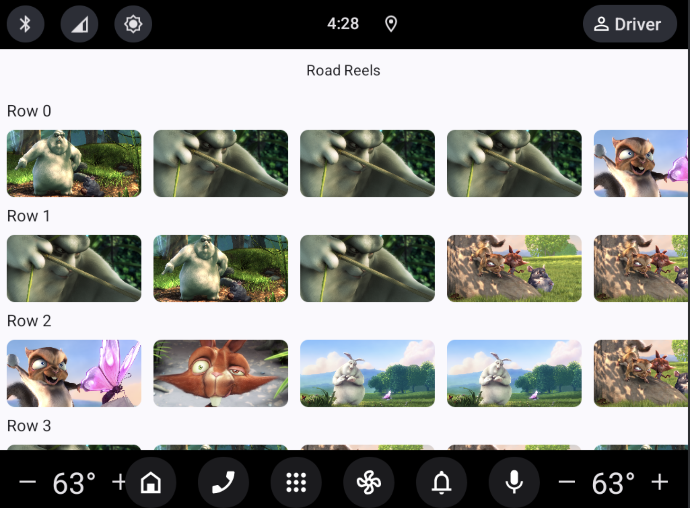

  User may continue to play with the application as they see fit.

This next part of the lab builds upon that application but allows user to install the application, using `adb`, through a MTK Connect tunnel connected to the Cuttlefish Virtual Device running in Horizon SDV.

**_Cuttlefish Virtual Device - APK Install:_**

- Open Jenkins → `Android Workflows` → `Tests` → `CVD Launcher`
- Repeat the steps from Foundation to run `CVD Launcher` , use the artifact URL that contains the change made for that previous exercise.
  - Set `CUTTLEFISH_KEEP_ALIVE_TIME` to one hour or more, depending on your needs.
  - Ensure `CUTTLEFISH_INSTALL_WIFI` is enabled otherwise you won’t be able to play the ‘Big Buck Bunny' media files.
- Wait for the `CVD Launcher` job to transition to `Keep Devices Alive` stage so that MTK Connect has a testbench to tunnel to.
- Open MTK Connect application, install the MTK Connect tunnel on your PC and connect:
  - Select the user/settings menu ( ) and select `Tunnels`

    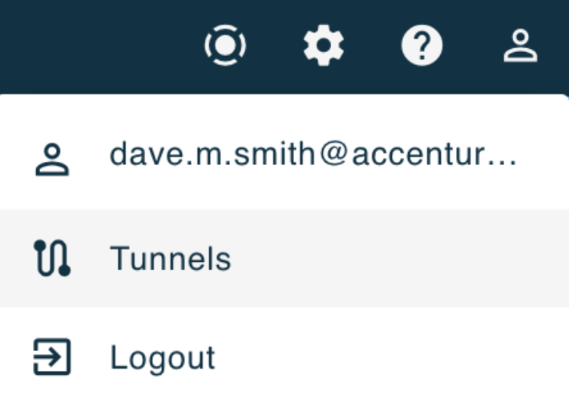

  - Open the _'Please install MTK Connect Tunnel'_ link:

    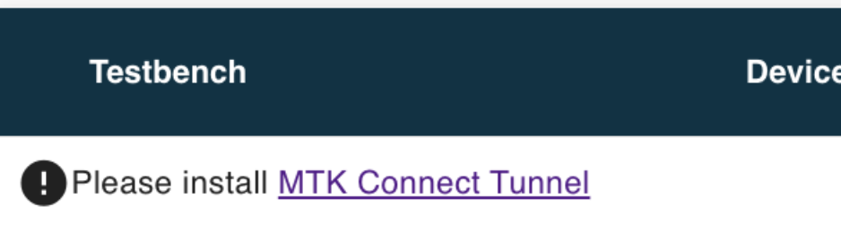

  - Follow the instructions to install the Tunnel based on your PC (Mac, Windows, Linux), e.g Mac:

    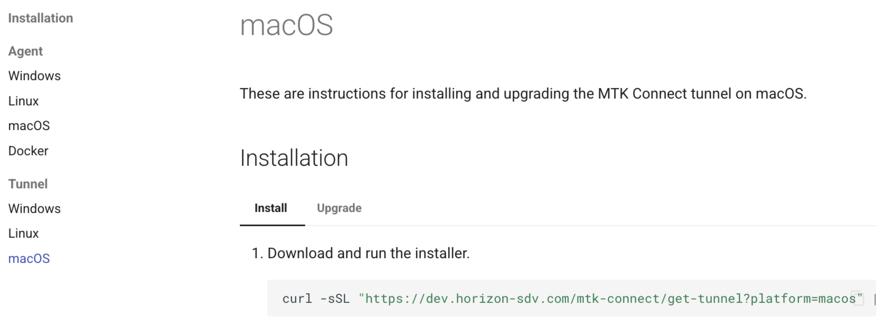

  - Once installed. Head back to MTK Connect application, `Tunnels` and click `+` and enter the details of your test bench and choose an appropriate port (8555) on your PC and select `Save`, e.g.

    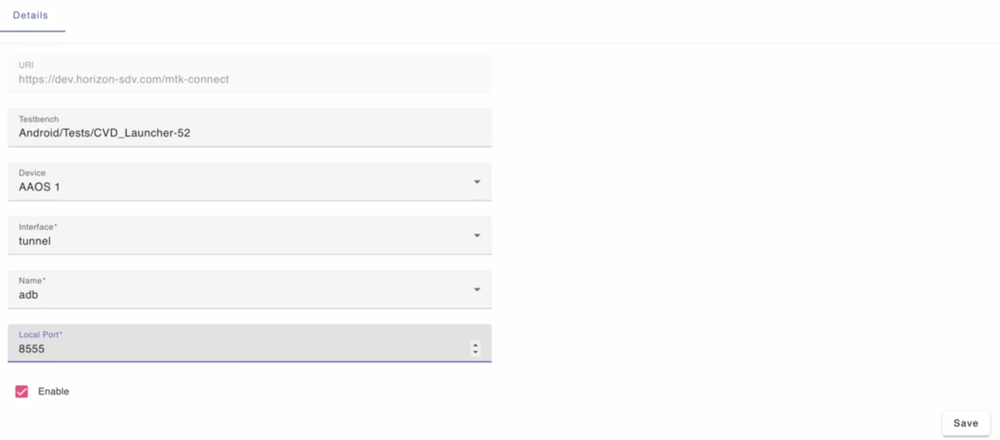

- In Android Studio
  - Ensure Road Reels application is open.
  - Build the APK:

    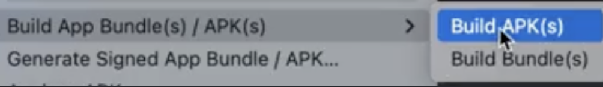

  - Open the terminal session in Android Studio and locate the APK ready to install (should be under `app/build/outputs/apk/debug`)

    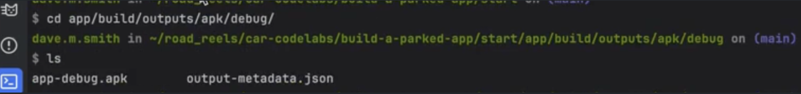

  - Connect `adb` (noting that you use the same port you used to create the tunnel, e.g. 8555) and install the APK:
    - `adb connect localhost:8555`
    - `adb install app-debug.apk`

      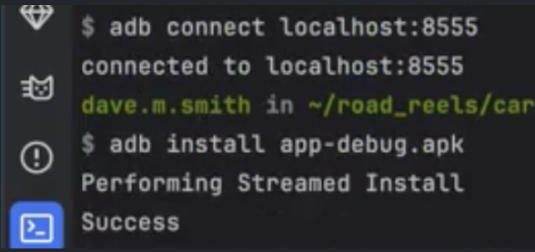

  - Now connect to the device using `Device Manager`:

    

  - Now you can see the device on MTK Connect and via Android Studio.
  - The Road Reels  application can now be launched.

    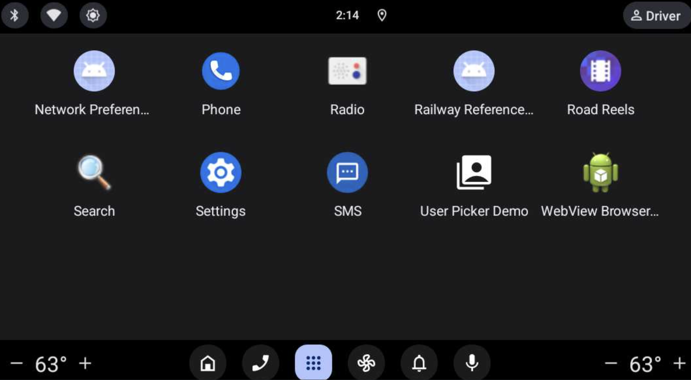
___

</details><br/>

#### <span style="color:#335bff">5.2.3 Boot Animation<a name="5-2-3-boot-animation"></a></span>

**Learning Objective**

Upon completing this exercise, you will acquire practical skills in updating the default Android boot animation and evaluate using Android Studio's Android Emulator.

<details><summary><b>Lab Exercise</b></summary>

___

> **Note:**
> This is optional. Included if developer is interested in changing the Android Boot Animation.
>
> Refer to Google [README](https://android.googlesource.com/platform/packages/services/Car/+/refs/tags/android-14.0.0_r30/car_product/car_ui_portrait/bootanimation/README) and [FORMAT.md](https://android.googlesource.com/platform/frameworks/base/+/master/cmds/bootanimation/FORMAT.md) for further details.

>**Important:**
> Cloning / editing of code should be performed as per usual methods - it is not intended that this be done in Android Studio.


**_Clone Repo:_**

> **Important:**
> - URLs differ per project, so do not cut and paste from this text, copy from Gerrit only.
> - Remember to use your Horizon SDV Gerrit credentials and HTTP token/password as mentioned in earlier sections. How you manage those is entirely up to you.

- Open Gerrit (e.g. https://example.horizon-sdv.com/gerrit/) and navigate to the repositories area.
- Clone the `android/platform/packages/services/Car` repo
  - `Gerrit` → `BROWSE` → `Repositories` → `android/platform/packages/services/Car`
    - Copy the `Clone with commit-msg hook` and start clone, e.g.
    ```
     git clone "https://example.horizon-sdv.com/gerrit/android/platform/packages/services/Car" && (cd "Launcher" && mkdir -p git rev-parse --git-dir/hooks/ && curl -Lo git rev-parse --git-dir/hooks/commit-msg https://example.horizon-sdv.com/gerrit/tools/hooks/commit-msg && chmod +x git rev-parse --git-dir/hooks/commit-msg)
    ```
**_Update Boot Animation:_**

- Android Boot Animation archive can be found here:

  ```Car/car_product/bootanimations/bootanimation-832.zip```

- Android Makefile to reference the boot animation is here:

   ```Car/car_product/build/car_generic_system.mk```

The Android boot animation archive contains partX directories which contain the image files, and a description file, `desc.txt`.

The `desc.txt` file describes the resolution of the boot animation and the PNG files, sequence (loops / delays). e.g.

```
832 520 30. Resolution: <WIDTH> <HEIGHT> <FRAMERATE>
c 1 30 part0 <TYPE> <COUNT> <PAUSE> <PATH>
c 1 0 part1
...
```

The PNG files must be unique and sequence from `000.png` to `999.png`.

**_Create the boot animation sequence files:_**
- Create you PNG files and decide on sequence. If using a video, then use a video splitter tool to convert video to frames.
  - PNG files are named `000.png` and increment, up to `999.png`

- You may reuse the Android boot animation and simply decide to modify a few images.
- Create a new archive (only archive the `desc.txt` and `partX` directories and content), e.g.

  ```
  # Store it under Car/car_product/bootanimations/
  zip -0qry -i \*.txt \*.png \*.wav @ ../horizon-animation.zip *.txt part*
  ```
- Update the `Car/car_product/build/car_generic_system.mk` makefile to use your new animation, e.g.
  ```
  # Boot animation
  PRODUCT_COPY_FILES += \
      packages/services/Car/car_product/bootanimations/horizon-animation.zip:system/media/bootanimation.zip
  ```
- Save, commit and push the change for review.
- Once the Gerrit builds have finished, decide on which target you wish to use in test. Retrieve from GCS bucket identified in the build archive files.

**_Test the change:_**

Use the previous lab exercises and download the SDK AVD system image and add-ons file, and update (delete and create) a new virtual device for this example. Verify the boot animation is updated as expected.

</details><br/>

---

### <span style="color:#335bff">5.3 Innovation<a name="5-3-innovation"></a></span>

This part of the lab is intentionally open-ended, allowing developers to explore and experiment with the platform freely. Your goal is to:
- Investigate and learn about the platform's capabilities
- Provide valuable feedback to the broader team, helping to shape and improve the platform

Now that you've gained experience with the virtual devices in the previous lab exercises, feel free to try out your own applications and test them on these devices. If you're interested in deploying your applications to Pixel Tablets, we recommend checking out the Platform Developer labs for guidance.

If you're looking for inspiration, there are many example applications available online that you can experiment with, such as:
- Google Code Labs:
  - [Car App Library Fundamentals](https://developer.android.com/codelabs/car-app-library-fundamentals?hl=en#0)
  - [Accessibility Testing with Espresso](https://developer.android.com/codelabs/a11y-testing-espresso#0)
 - [Android Car Samples on GitHub](https://github.com/android/car-samples)

Additionally, you can explore working with newer Android revisions by referring to the Appendix section, which explains how to:
- Use Horizon SDV Gerrit-supported versions
- Build against the upstream Google AOSP Gerrit and its revisions

> [!IMPORTANT]
> Please note that while there are no version restrictions (other than those imposed by the Gerrit job), lunch targets are still subject to certain limitations. Specifically, they are restricted to the prefixes defined in the Appendix.

For more detailed information on supported workloads, refer to the OSS repository: [horizon-sdv](https://github.com/googlecloudplatform/horizon-sdv), specifically the `docs/workloads` section.

---

## <span style="color:#335bff">6. Platform Developer<a name="6-platform-developer"></a></span>
The lab exercises are organised into three levels:

- **Foundation** (Objective: Gain a basic understanding of the platform)
- **Proficiency** (Objective: Intermediate Training, building on foundational knowledge, this training provides additional guidance on leveraging advanced features of the platform.)
- **Innovation** (Objective: Developers have the flexibility to explore and experiment with the platform as they see fit, with the expectation that they will provide feedback to the broader team, helping to shape and improve the platform.)

> [!IMPORTANT]
> - Before proceeding with these exercises, please note the URLs referenced in the instructions reference an example domain.
>   - Replace `example.horizon-sdv.com` in the URLs with your domain

### <span style="color:#335bff">6.1 Foundation<a name="6-1-foundation"></a></span>

The objective of this set of lab exercises is to gain a basic understanding of the Horizon SDV platform.

It will demonstrate the following:

- Building the Android Compatibility Test Suite (CTS).
- Building the Pixel Tablet target in readiness for later lab exercises.
- Building Android Cuttlefish Virtual Device target for use with the Cuttlefish host platform and verifying through the use of MTK Connect and CTS
  - Test the Cuttlefish virtual device images with `CVD Launcher` and `CTS Execution` jobs.
  - Using MTK Connect to access and interact with the Cuttlefish Virtual Devices.
  - Test the user built test suite with the `CTS Execution` job.

#### <span style="color:#335bff">6.1.1 Android Compatibility Test Suite<a name="6-1-1-android-compatibility-test-suite"></a></span>

**Learning Objective**

By completing this exercise, you will have learned about the process of building CTS, rather than relying on the default Google versions.

Currently, our test jobs rely on the default Android CTS versions provided by Google, which are pre-installed on the VM instances used to launch Cuttlefish Virtual Devices. But the purpose of this build, is to allow user flexibility to test with their own CTS, rather than the default versions.

<details><summary><b>Lab Exercise</b></summary>

___

In this exercise, we will walk you through the process of building your own CTS for later usage, rather than relying on the default Google versions.

> **Note:**
> Run this job 1st because  building the CTS can take 40 minutes. Kick off the build and use the built artifacts for later in the lab.

**_Create the CTS target:_**

- Open Jenkins Dashboard (e.g. https://example.horizon-sdv.com/jenkins/) and navigate to `AAOS Builder` pipeline job to prepare build targets that will be used in this lab exercise.
- Select `Android Workflows` → `Builds` → `AAOS Builder`
  - Select `Build with Parameters`, set the `AAOS_LUNCH_TARGET` to `aosp_cf_x86_64_auto-bp3a-userdebug`, set AAOS_BUILD_CTS to true, and select `Build`

  - When the build completes, the job will show the artifacts it has stored. These help the user locate the build artifacts within the Google Cloud Storage bucket.

  - Open the `aosp_cf_x86_64_auto-bp3a-userdebug-artifacts.txt` which will show you how to retrieve the artifacts.

    - Note the storage URL for `android-cts.zip` for later use in test jobs, e.g. `gs://sdva-2108202401-aaos/Android/Builds/AAOS_Builder/03/android-cts.zip`. You do not need to download these artifacts, later jobs will simply reference the URL.

___

</details><br/>

#### <span style="color:#335bff">6.1.2 Pixel Tablet<a name="6-1-2-pixel-tablet"></a></span>

**Learning Objective**

By completing this exercise, you will have learned about building for Pixel Tablet hardware platform targets.

<details><summary><b>Lab Exercise</b></summary>

___

You will build the Pixel Tablet target for use in later exercises.

**_Create the Pixel (tangorpro_car) target_:**

- Open Jenkins Dashboard (e.g. https://example.horizon-sdv.com/jenkins/) and navigate to `AAOS Builder` pipeline job to prepare build targets that will be used in a later lab exercise.
- Select `Android Workflows` → `Builds` → `AAOS Builder`
  - Select `Build with Parameters` and set the `AAOS_LUNCH_TARGET` to `aosp_tangorpro_car-bp1a-userdebug` and select `Build`

    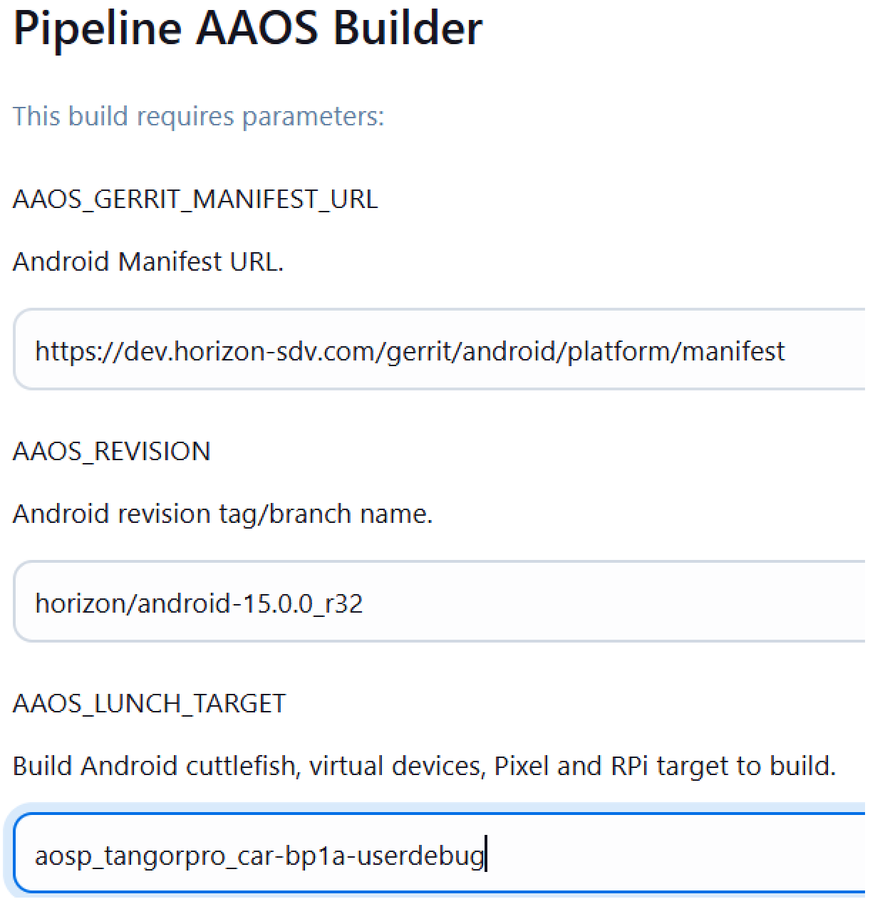

  - To identify your job within the pipeline, refer to the Builds summary section. This section provides a concise description of each build, i.e.:
    - The target and branch built.
    - Who ran the build job.

      

  - When build completes, the job will show the artifacts it has stored. These help the user locate the build artifacts within the Google Cloud Storage bucket.

  - Open the `aosp_tangorpro_car-bp1a-userdebus-artifacts.txt` which will show you how to retrieve the artifacts, e.g.

    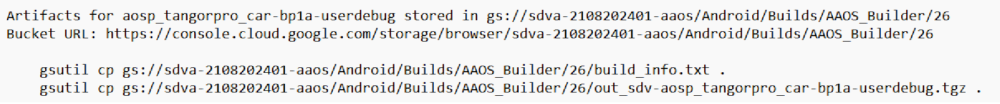

    - Note the URL to download the `out_sdv-aosp_tangorpro_car-bp1a-userdebug.tgz` to your local machine for use in later exercises.

___

</details><br/>

#### <span style="color:#335bff">6.1.3 Cuttlefish Virtual Devices<a name="6-1-3-cuttlefish-virtual-devices"></a></span>

**Learning Objective**

By completing this exercise, you will have learned about building Cuttlefish Virtual Device targets for running on the Cuttlefish host VMs together with using CVD launcher and CTS.

<details><summary><b>Lab Exercise</b></summary>

___

You will build a Cuttlefish Virtual Device target and test it using `CVD launcher` and `CTS`.

**_Create Cuttlefish Virtual Device target:_**

- Open Jenkins Dashboard (e.g. https://example.horizon-sdv.com/jenkins/) and navigate to `AAOS Builder` pipeline job to prepare build targets that will be used in this lab exercise.
- Select `Android Workflows` → `Builds` → `AAOS Builder`
  - Select `Build with Parameters` and set the `AAOS_LUNCH_TARGET` to `aosp_cf_x86_64_auto-bp3a-userdebug` and select `Build`
  - When build completes, the job will show the artifacts it has stored. These help the user locate the build artifacts within the Google Cloud Storage bucket for use with testing CF Virtual Devices and connecting to the device through Android Studio.

    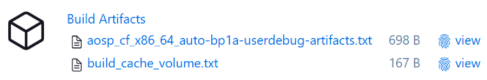

  - Open the `aosp_cf_x86_64_auto-bp3a-userdebug-artifacts.txt` which will show you were the artfifacts are stored, e.g.

    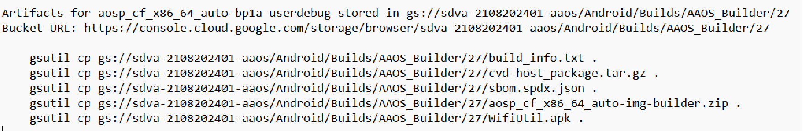

    - Note the storage location, e.g. `gs://sdva-2108202401-aaos/Android/Builds/AAOS_Builder/27` you will need that for testing. There is no need to download these artifacts.

**_Launch Cuttlefish Virtual Device:_**

> **Note:**
> This will require the Google Cloud Storage bucket URL you saved from the build section where you built the Cuttlefish Virtual devices.

- Open Jenkins Dashboard (e.g. https://example.horizon-sdv.com/jenkins/) and navigate to `CVD Launcher` pipeline job.
- Select `Android Workflows` → `Tests` → `CVD Launcher`
  - Select `Build with Parameters` and define the `CUTTLEFISH_DOWNLOAD_URL` with the URL you saved previously, enable `CUTTLEFISH_INSTALL_WIFI` and define the time to keep the instance alive, `CUTTLEFISH_KEEP_ALIVE_TIME` and select `Build`,e.g.

    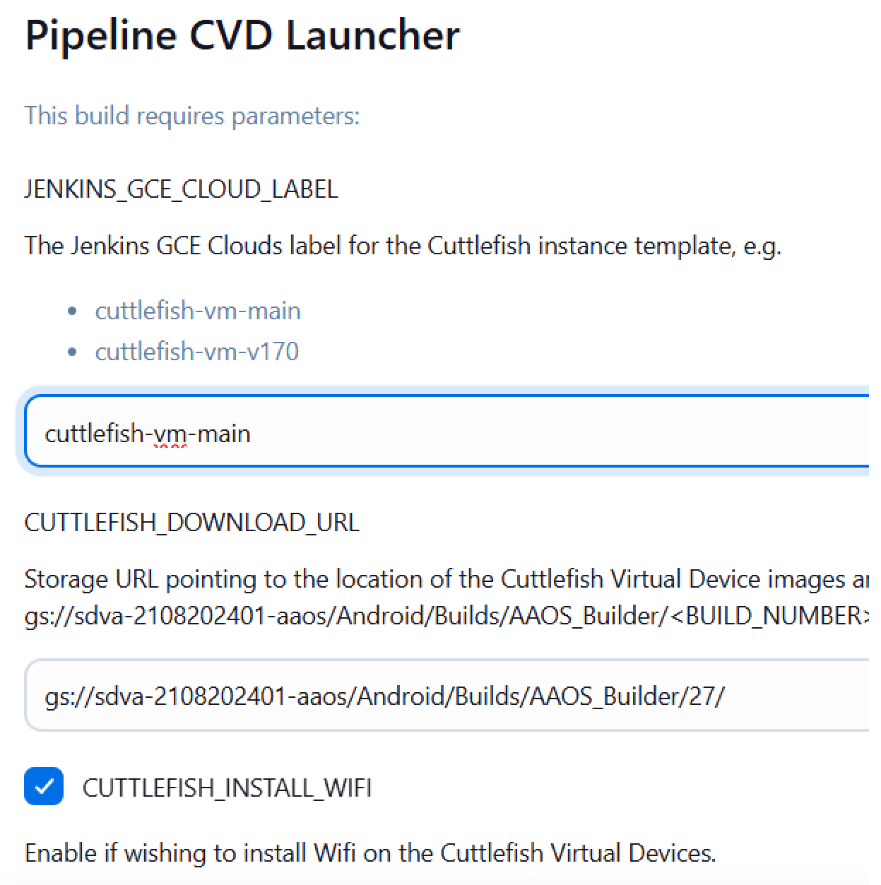

    Note: `CUTTLEFISH_DOWNLOAD_URL` is the path and not a file, ensure you paste the correct URL from your prior CF build.<br/>

    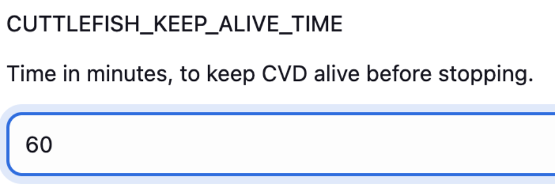

    Note: `CUTTLEFISH_KEEP_ALIVE_TIME`, only select for as long as you may wish to run the session, instances cost money.

  - Wait for job to enter the `Keep Devices Alive` stage and then we can use MTK Connect to verify the device

**_Verify in MTK Connect Application:_**

- Open MTK Connect application from landing page (link in jenkins description of CVD Launcher job), or the URL reported within the console log for the CVD Launcher job.
  - Select `TESTBENCHES` option within the application:

    

  - Find your Testbench, select it and then select a device, in this case it’s AAOS 1, e.g.

    

    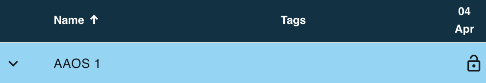

    > **Note:**
    > - Testbench should be identifiable from your CVD Launcher job name and number, e.g. `Android/Tests/CVD_Launcher-8`
    > - Refresh the browser page if your testbench has yet to appear.
    > - The console log provides a summary of the MTK Connect URL and Testbench name.

  - Select the duration you wish to `Book the device` (select the padlock symbol), e.g.

    

  - You can now use MTK Connect to interact with the device through the UI:

    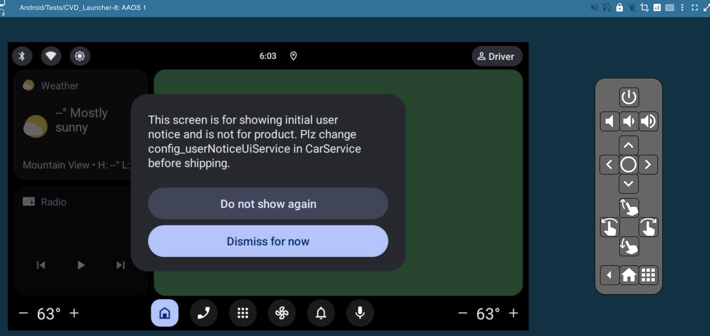

    - Select the three dots symbol -> `Launch` -> `adb` to connect to the device via adb.
    - Select the three dots symbol -> `Launch` -> `HOST` to connect to the cuttlefish host platform via adb.

  - Familiarise yourself with the `CVD Launcher` job and `MTK Connect` because we will be using this in later exercises.

This next stage demonstrates the `Compatibility Test Suite` test job.

**_Run CTS on the Cuttlefish Virtual Devices:_**

> **Note:**
> This will require the Google Cloud Storage bucket URL you saved from the build section where you built the Cuttlefish Virtual devices.

- Open Jenkins Dashboard (e.g. https://example.horizon-sdv.com/jenkins/) and navigate to `CTS Execution` pipeline job.
- Select `Android Workflows` → `Tests` → `CTS Execution`
  - Select `Build with Parameters` and define the `CUTTLEFISH_DOWNLOAD_URL` with the URL you saved previously and define the time to keep the instance alive, `CUTTLEFISH_KEEP_ALIVE_TIME` and select `Build`,e.g.

    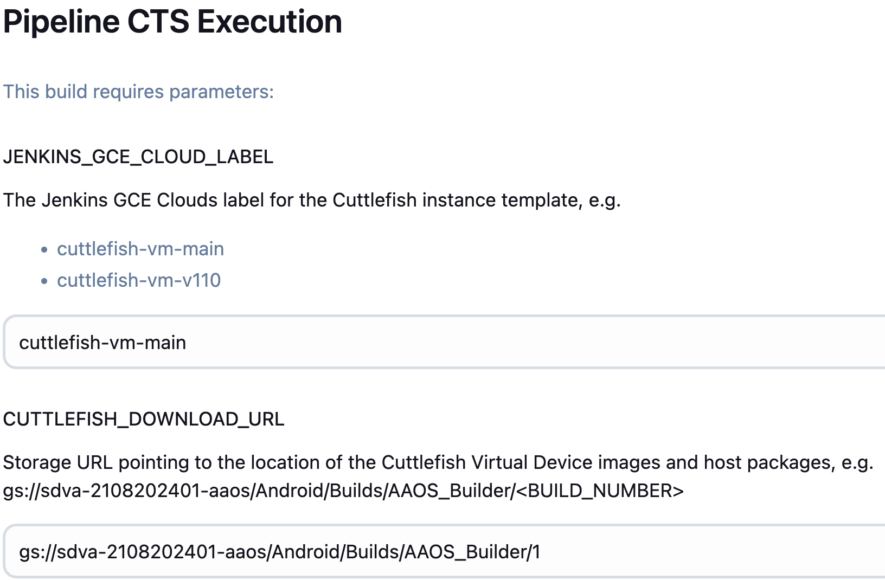

    - By default we will run a single test module using the default `CtsDeqpTestCases` value specified for the `CTS Module` parameter:

      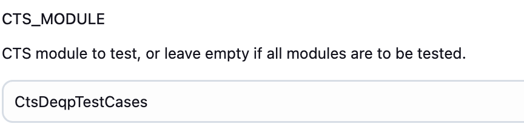

    - The `CTS Test Plan` is set to `cts-virtual-device-stable` by default:

      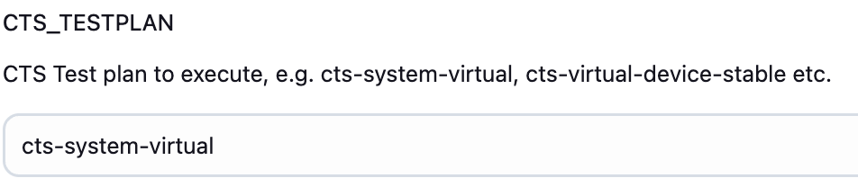

    - User may later decide to change the test module and plans to suit their needs.

    - User may wish to use MTK Connect to verify UI tests, to do so, enable `MTK_CONNECT_ENABLE` before building.

> **Note:**
> Multiple cuttlefish devices can be launched in parallel, in which case CTS tests are spread between then - use `NUM_INSTANCES` parameter to specifiy 1-8 devices. Note that testing is spread over devices on a module-by-module basis, so if you want to see multiple devices being used for testing you will need to run a full CTS test plan (i.e. leave the `CTS MODULE` parameter empty).

**_CTS Artifacts:_**

 - When the test has completed, the Jenkins job stores the CTS artifacts such as details of the CTS Modules, Test Plans, Results etc:

   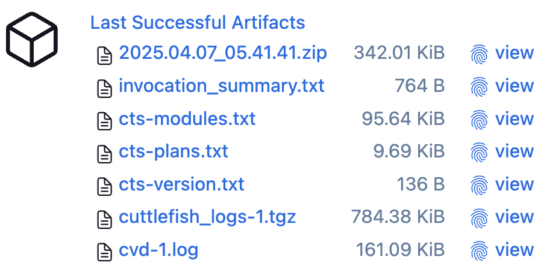

- Summary of artifacts:
  - `cts-modules.txt` shows the available modules for `CTS_MODULE` parameter
  - `cts-plans.txt` shows the available plans for `CTS_TESTPLAN` parameter
  - `invocation_summary.txt` shows the test result summary
  - The zip file contains the full set of results files.

- You may rerun the test with different modules (`CTS_MODULE` empty will run a full set of modules).

**_Test user defined CTS:_**
> **Note:**
> This can be performed in parallel with the previous section.

In the previous exercise where you built the CTS using `AAOS Builder` job, you may now use that `android-cts.zip` instead of the default CTS provided by Google.

 - Repeat the `Build with Parameters` steps as per above but this time we will define `CTS_DOWNLOAD_URL` so the test will use your prebuilt CTS:

   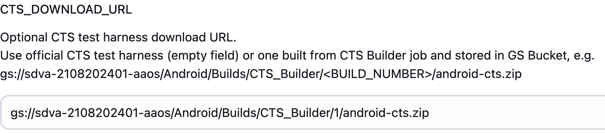

- Enter your build URL from the fiirst exercise, e.g. `gs://sdva-2108202401-aaos/Android/Builds/AAOS_Builder/01/android-cts.zip`
  - Note: ensure it is the full URL including `android-cts.zip`
- Then select `Build`. This job takes a little longer as it pulls down and unpacks your `android-cts.zip` from Google
  Cloud Storage.

The job will complete and provide you with the test results, artifacts as per previous examples.

___

</details><br/>

#### <span style="color:#335bff">6.1.4 Gerrit Review - Build pipeline<a id="6-1-4-gerrit-review---build-pipeline"></a></span>

**Learning Objective**

Upon completing this exercise, you will gain hands-on experience in making code changes, pushing for review in Gerrit, automated triggering of the Gerrit build pipeline job, and verifying the build targets using Cuttlefish host VMs, and MTK Connect.

> [!NOTE]
> This example provides a basic change to guarantee that the Gerrit build pipeline is triggered, builds are successful and result is reported back to Gerrit in review comments and the VERIFIED label.
>
> Gerrit and the Jenkins build pipeline is for demonstration purposes only, it builds the following targets:
> - `sdk_car_x86_64`
> - `sdk_car_arm64`
> - `aosp_cf_x86_64_auto`
> - `aosp_tangorpro_car`
>
> and runs a simple single module CTS test module. During each stage of the build, the jobs stores the artifact file for each target showing where to retrieve the build artifacts for test purposes. You may choose to use those targets before the pipeline completes or wait until the full pipeline job completes successfully.
>
> Please retain the repo for later exercises.

<details><summary><b>Lab Exercise</b></summary>

___

**_Modify the code and push to Gerrit:_**

> **Important:**
> - URLs differ per project, so do not cut and paste from this text, copy from Gerrit only.
> - Remember to use your Horizon SDV Gerrit credentials and HTTP token/password as mentioned in earlier sections. How you manage those is entirely up to you.

- Open Gerrit (e.g. https://example.horizon-sdv.com/gerrit/) and clone the `android/platform/frameworks/native` repo.
  - `Gerrit` → `BROWSE` → `Repositories` → `android/platform/frameworks/native`
    - Copy the `Clone with commit-msg hook` and start clone, e.g.
      ```
      git clone "https://example.horizon-sdv.com/gerrit/android/platform/frameworks/native" && (cd "Launcher" && mkdir -p git rev-parse --git-dir/hooks/ && curl -Lo git rev-parse --git-dir/hooks/commit-msg https://example.horizon-sdv.com/gerrit/tools/hooks/commit-msg && chmod +x git rev-parse --git-dir/hooks/commit-msg)
       ```
       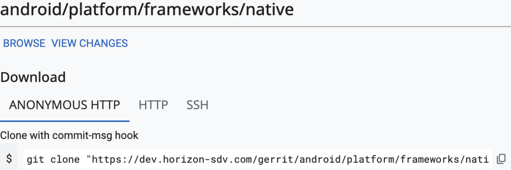

- Edit `services/surfaceflinger/SurfaceFlinger.cpp` and add the following comment:
  ```// <Your Name> - test Gerrit pipeline```
- Save and push the change for review:
  - Commit: `git commit -am "Surface Flinger basic test"`
  - Update Change ID if one was not automatically generated in your commit: `git commit --amend --no-edit`
  - Push for Review: `git push origin HEAD:refs/for/horizon/android-16.0.0_r3`
    - The remote should report success and provide a link back to the Gerrit review, e.g.
      - `https://example.horizon-sdv.com/gerrit/c/android/platform/frameworks/native/+/184 Surface Flinger basic test [NEW]`

- The Gerrit change triggers the Gerrit build job in Jenkins:
  - Open the review URL in Gerrit and look for Gerrit build job, e.g.

    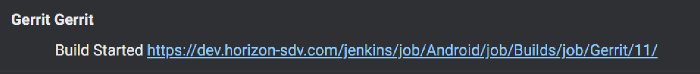

  - Open Jenkins or access the build from the URL in the Gerrit comments.

**_Monitor the build:_**
- Within Jenkins application, `Android Workflows` → `Builds` → `Gerrit`
- Your job will be identifiable under the `Builds` and `Stage View` sections by the name of the project, Gerrit Change ID and Patchset number e.g.

  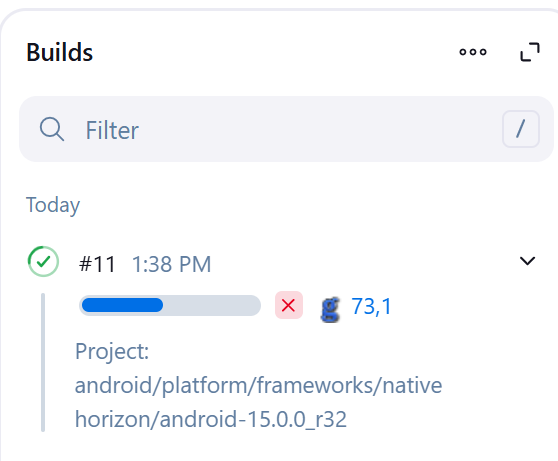

  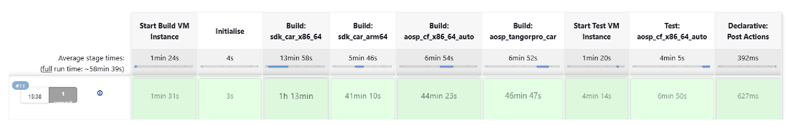

- The Gerrit builder creates the artifact summaries in Jenkins to help identify the bucket URL to retrieve the build artifacts required for verification/test, e.g.

  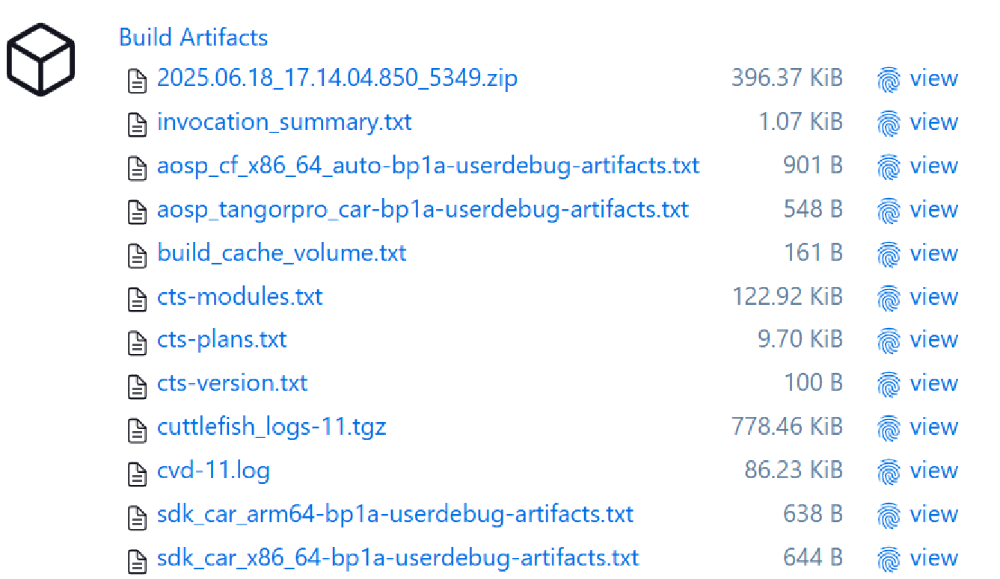

  - Pick the artifact file for the target application that suits your test environment: e.g. `aosp_cf_x86_64_xxx` for Cuttlefish Virtual Devices. And note the GCS storage location as per previous foundation exercises.

**_Test the change:_**

Decide whether you wish to test the change (e.g. with the `CVD Launcher` and/or `CTS Execution` jobs) or defer to later lab exercises.

</details><br/>

---

### <span style="color:#335bff">6.2 Proficiency<a id="6-2-proficiency"></a></span>

The objective of this set of lab exercises is to build upon the foundational knowledge of the Horizon SDV platform. It provides guidance to leverage more advanced features of the platform.

It will demonstrate the following:

- Build and test a change to the `android/platform/frameworks/native` within Horizon SDV platform.
- Flash the Pixel Tablet hardware platform with the previous build from Foundations exercises.

#### <span style="color:#335bff">6.2.1 Gerrit Review - Build pipeline<a id="6-2-1-gerrit-review---build-pipeline"></a></span>

**Learning Objective**

Upon completing this exercise, you will acquire practical skills in making real-world code changes, staging them in Gerrit Code Review, and the automated build pipeline. You will also verify the build targets using Cuttlefish host VMs, and MTK Connect, to confirm that changes have been successfully applied.

> [!NOTE]
> This example builds upon the previous code changes but this time, the change is visible in the UI when the launcher runs. You are welcome to make any changes you see fit.

<details><summary><b>Lab Exercise</b></summary>

___

> **Note:**
> This example provides a basic change so that the change is visible in the UI when the Cuttlefish device boots. You are welcome to make any changes you see fit but initially best to keep simple for sake of demonstrating the pipeline.

**_Modify the Surface Flinger code and push to Gerrit review:_**

- Open Gerrit (e.g. https://example.horizon-sdv.com/gerrit/) and clone the `android/platform/frameworks/native` repo.
- `BROWSE` → `Repositories` → `android/platform/frameworks/native`
- Copy the `Clone with commit-msg hook` and perform the clone

- `cd native`

- Edit `services/surfaceflinger/SurfaceFlinger.cpp` and make the following changes:
  - Search for the following line in `SurfaceFlinger::composite`:
    ```
    refreshArgs.devOptForceClientComposition = mDebugDisableHWC;
    ```
  - Add the following code snippet before that line:
    ```
    refreshArgs.colorTransformMatrix =
            mat4(vec4{1.0f, 0.0f, 0.0f, 0.0f}, vec4{0.0f, -1.0f, 0.0f, 0.0f},
                 vec4{0.0f, 0.0f, -1.0f, 0.0f}, vec4{0.0f, 1.0f, 1.0f, 1.0f});
    ```
  - Search for the following in `SurfaceFlinger::renderScreenImpl`:
    ```
    .updatingGeometryThisFrame = true,
    .colorTransformMatrix = calculateColorMatrix(colorSaturation),
    ```
    and replace it with the following:
    ```
    .updatingGeometryThisFrame = true,
    .colorTransformMatrix =
                mat4(vec4{1.0f, 0.0f, 0.0f, 0.0f}, vec4{0.0f, -1.0f, 0.0f, 0.0f},
                     vec4{0.0f, 0.0f, -1.0f, 0.0f}, vec4{0.0f, 1.0f, 1.0f, 1.0f}),
    ```
  - There may be an unused variable that will show an error; do the following to avoid the error:
    - Search for the following line:
    ```
    return output->getRenderSurface()->getClientTargetAcquireFence()`;
    ```
    - Add the following code snippet before that line:
    ```
    base::StringPrintf("%.2fadb", colorSaturation);
    ```
- Save, commit and push the change for review (refer to previous labs for how to achieve this).

**_Monitor the build:_**

- If you can’t wait for the Gerrit build to complete the SDK AVD and CF Virtual device builds, then you may run the build manually as per Foundation,
  - `Android Workflows` → `Builds` → `AAOS Builder` → `Build with Parameters`
  - Define the `AAOS_LUNCH_TARGET` to build `aosp_cf_x86_64_auto-bp3a-userdebug` and update the `GERRIT_PROJECT`, `GERRIT_CHANGE_NUMBER` and `GERRIT_PATCHSET_NUMBER`, alternatively `GERRIT_TOPIC` parameters to identify the change you wish to include in the build (note that the required details are shown in the Gerrit build job that was triggered by the change), e.g.

    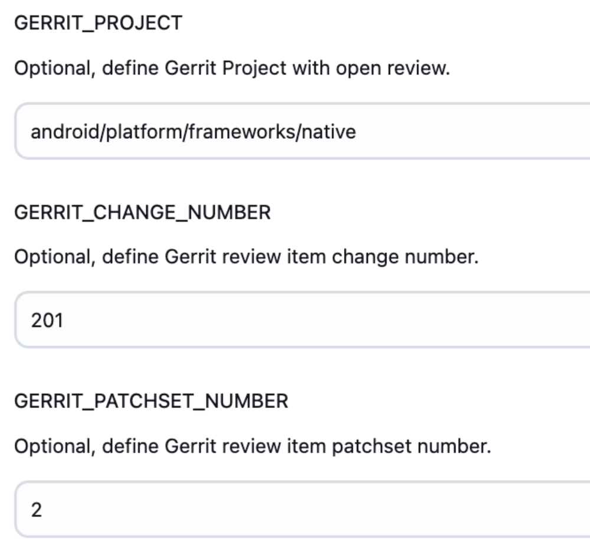

- As per the foundation examples, the auto-triggered Gerrit build job also creates the artifact summaries in Jenkins to help identify the bucket URL to retrieve the build artifacts required for verification/test.

**_Test the change:_**

- We will verify that the change has taken effect using `CVD Launcher`.
- **Cuttlefish Virtual Device**
  - Repeat the steps from Foundation to run `CVD Launcher`, remembering to use the artifact URL that points to the built image containing the change made for this exercise, e.g. below shows the Gerrit artifact but also remember to define `CUTTLEFISH_KEEP_ALIVE_TIME` to suit your needs.

    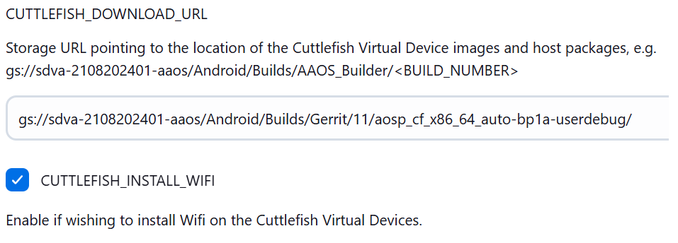

    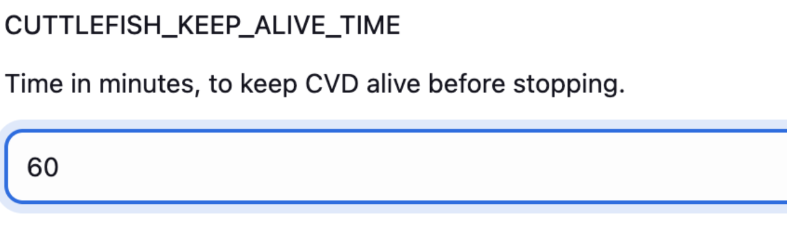

  - From MTK Connect, check the application was updated correctly, e.g.

    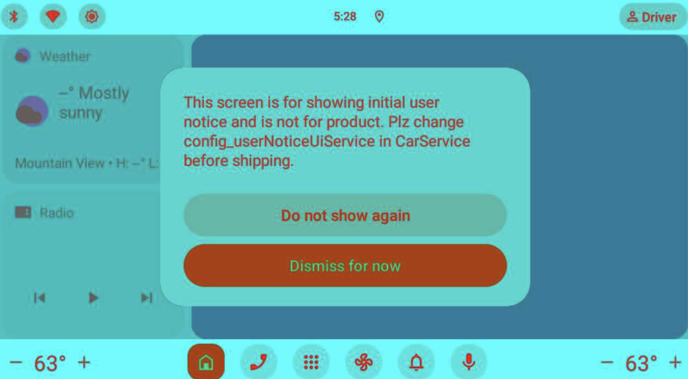

    Note the colour transform changes.

___

</details><br/>

#### <span style="color:#335bff">6.2.2 Flashing Pixel Tablet<a id="6-2-2-flashing-pixel-tablet"></a></span>

**Learning Objective**

Upon completing this exercise, you will acquire practical skills to deploy and flash Pixel Tablet platforms.

<details><summary><b>Lab Exercise</b></summary>

___

> **Note:**
> This lab requires the Pixel Tablet target you built in the Foundation lab exercise.
>
> Google will provide Pixel Tablets for use in this exercise. Initially we will test with devices connected to developers laptops but later a demonstration may be provided for remote connection to devices via MTK Connect and tunnels.
>
> The flash process is also detailed in [Pixel devices as development platforms](https://source.android.com/docs/automotive/start/pixelxl).

> **Important:**
> Assumes `adb` and `fastboot` installed on local PC.
> Refer to `Common Developer Preparation` section.
> Charging cable should be unplugged - if plugged in, see Tip at bottom

**_Set up the device to flash the build:_**

- **Unlock the device:**
  - Enable **Developer options** from `Settings > System > About Phone` and then tap `Build Number` seven times.
  - Enable **USB debugging** and **OEM unlocking** from `Settings > System > Developer options`

- **Flash the Build:**
  - Onto your own machine, download the Pixel Tablet artifact previously built in the Foundations lab exercise, e.g.
    ```
    gcloud storage cp gs://sdva-2108202401-aaos/Android/Builds/AAOS_Builder/02/out_sdv-aosp_tangorpro_car-bp1a-userdebug.tgz .
    ```
  - Unpack the artifacts:
    ```
    tar -zxf out_sdv-aosp_tangorpro_car-bp1a-userdebug.tgz
    ```
  - Define `ANDROID_PRODUCT_OUT` so `fastboot` can detect the `fastboot-info.txt` file and images to flash.
    ```
    export ANDROID_PRODUCT_OUT=out_sdv-aosp_tangorpro_car-bp1a-userdebug/target/product/tangorpro
    ```
    - We do not have `LUNCH` target nor the full `OUT_DIR` hence we define the environment variable for `fastboot`.

    > **Note:**
    > If a windows user and not using [WSL](https://learn.microsoft.com/en-us/windows/wsl/) then replace `export` with `set`.

  - Place the device into fastboot mode and then unlock it
    ```
    adb reboot bootloader
    fastboot flashing unlock
    ```

  - On the device, select `Unlock the Bootloader`. Doing so erases **_all_** data on the device!

    > **Note:**
    >
    > The `adb reboot bootloader` command:
    > - _This command initiates a reboot of the Android device, specifying that the device should enter the bootloader mode upon restarting._<br/><br/>
    >
    > **Key Combination:**
    > - Most devices require a specific key combination (e.g., pressing volume down while the device boots) to enter the bootloader mode. This combination needs to be pressed during the reboot process triggered by the `adb reboot bootloader` command.<br/><br/>
    >
    > **Bootloader Activation:**
    > - The physical interaction with the device (pressing the key combination) is what actually forces the device to boot into the bootloader instead of its normal OS.

  - To flash the build:
    ```
    fastboot -w flashall
    ```
  - After the build starts booting with animation:
    - Enable adb remount:
      ```
      # Temporary disable the userdata checkpoint
      adb wait-for-device root; sleep 3; adb shell vdc checkpoint commitChanges; sleep 2
      # Enable remount
      adb remount && sleep 2 && adb reboot && echo "rebooting the device" && adb wait-for-device root && sleep 5 && adb remount
      ```
    - Push the required Automotive-specific files to the device:
      ```
      adb sync vendor && adb reboot
      ```
    - Wait for the device to boot, e.g.

      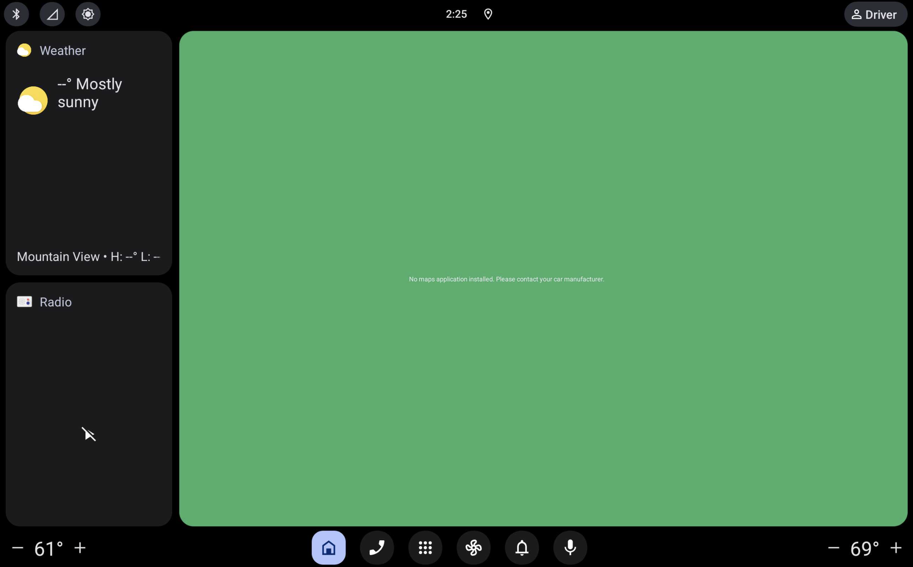

    - User may now setup networking on the device and play.

- **Tips**
  - If you see screen brightness too low:
    ```
    adb shell settings put system screen_brightness 255
    ```
  - Boot when charger is plugged in:
    ```
    adb reboot bootloader
    fastboot oem off-mode-charge 1
    fastboot reboot
    ```
  - Enable Mock location:
    ```
    adb unroot
    adb shell cmd location set-location-enabled true
    adb root
    adb shell appops set 0 android:mock_location allow
    adb shell cmd location providers add-test-provider gps
    adb shell cmd location providers set-test-provider-enabled gps true
    adb shell cmd location providers set-test-provider-location gps --location 37.090200,-95.712900
    #To verify
    adb shell dumpsys location | grep "last location"
    ```
> **Note:**
> If platform developers are interested in installing an APK, work with the application developers to provide them an APK and install the APK using adb install <APK FILENAME>.apk . The Application Developers exercises create the ‘Road Reels’ APK, perhaps team could share and this be installed.

___

</details><br/>

#### <span style="color:#335bff">6.2.3 Override make commands<a id="6-2-3-override-make-commands"></a></span>

**Learning Objective**

Upon completing this exercise, you will acquire practical skills in updating build job make commands, in case the default commands are not sufficient.

<details><summary><b>Lab Exercise</b></summary>

___

> **Note:**
> AAOS Builder job allows users to override the make commands, see `OVERRIDE_MAKE_COMMAND`, e.g. you may wish to build the HAL AIDL:
> `m android.hardware.automotive.vehicle.property-update-api && m dist`

This lab exercise shows how the user may override make commands, such as required when building HAL updates in `android/platform/hardware/interfaces`.

**_Clone Repo:_**

> **Important:**
> - URLs differ per project, so do not cut and paste from this text, copy from Gerrit only.
> - Remember to use your Horizon SDV Gerrit credentials and HTTP token/password as mentioned in earlier sections. How you manage those is entirely up to you.

- Open Gerrit (e.g. https://example.horizon-sdv.com/gerrit/) and navigate to the repositories area.
- Clone the `android/platform/hardware/interfaces` repo
  - `Gerrit` → `BROWSE` → `Repositories` → `android/platform/hardware/interfaces`
    - Copy the `Clone with commit-msg hook` and start clone, e.g.
    ```
     git clone "https://example.horizon-sdv.com/gerrit/android/platform/hardware/interfaces" && (cd "Launcher" && mkdir -p git rev-parse --git-dir/hooks/ && curl -Lo git rev-parse --git-dir/hooks/commit-msg https://example.horizon-sdv.com/gerrit/tools/hooks/commit-msg && chmod +x git rev-parse --git-dir/hooks/commit-msg)

**_Modify code to include a new property:_**

- Example simply demonstrates the build override, as to code changes, feel free to use your own, but we provide an example below.
- Modify the files as per following `git diff` (remove the new lines `+` markers):
  ```
  diff --git a/automotive/vehicle/aidl/impl/current/default_config/config/DefaultProperties.json b/automotive/vehicle/aidl/impl/current/default_config/config/DefaultProperties.json
  index 665c10e8e3..0a4ae2e0c6 100644
  --- a/automotive/vehicle/aidl/impl/current/default_config/config/DefaultProperties.json
  +++ b/automotive/vehicle/aidl/impl/current/default_config/config/DefaultProperties.json
  @@ -1,6 +1,12 @@
   {
       "apiVersion": 1,
       "properties": [
  +        {
  +            "property": "VehicleProperty::INFO_HORIZON_SDV",
  +            "defaultValue": {
  +                "stringValue": "HORIZON-SDV-LAB"
  +            }
  +        },
           {
               "property": "VehicleProperty::INFO_FUEL_CAPACITY",
               "defaultValue": {
  diff --git a/automotive/vehicle/aidl_property/android/hardware/automotive/vehicle/VehicleProperty.aidl b/automotive/vehicle/aidl_property/android/hardware/automotive/vehicle/VehicleProperty.aidl
  index acb6aeb5a1..e2c5c99ecb 100644
  --- a/automotive/vehicle/aidl_property/android/hardware/automotive/vehicle/VehicleProperty.aidl
  +++ b/automotive/vehicle/aidl_property/android/hardware/automotive/vehicle/VehicleProperty.aidl
  @@ -47,6 +47,15 @@ enum VehicleProperty {
        * This property must never be used/supported.
        */
       INVALID = 0x00000000,
  +
  +    /**
  +     * Horizon SDV lab property
  +     *
  +     * @change_mode VehiclePropertyChangeMode.STATIC
  +     * @access VehiclePropertyAccess.READ
  +     */
  +    INFO_HORIZON_SDV = 0x1000 + 0x10000000 + 0x01000000
  +            + 0x00100000, // VehiclePropertyGroup:SYSTEM,VehicleArea:GLOBAL,VehiclePropertyType:STRING
       /**
        * VIN of vehicle
        *
  ```
- Save, commit  and push the change for review (use previous examples for reference).
  - The Gerrit build will fail because the AIDL must be rebuilt, hence manual build following to include the additional make command step.

- In Jenkins, select `Android Workflows` → `Builds` → `AAOS Builder` → `Build with Parameters` and define the `AAOS_LUNCH_TARGET` and select ` Build`
  - `AAOS_LUNCH_TARGET` `aosp_cf_x86_64_auto-bp3a-userdebug`
  - `OVERRIDE_MAKE_COMMAND` `m android.hardware.automotive.vehicle.property-update-api && m dist`
  - `GERRIT_PROJECT` `android/platform/hardware/interfaces`
  - `GERRIT_CHANGE_NUMBER` to the number of the change in Gerrit
  - `GERRIT_PATCHSET_NUMBER` to the patchset number of the change in Gerrit.<br/>
  - `GERRIT_TOPIC` If more than a single change, use Gerrit Topic value.<br/>
     e.g.

     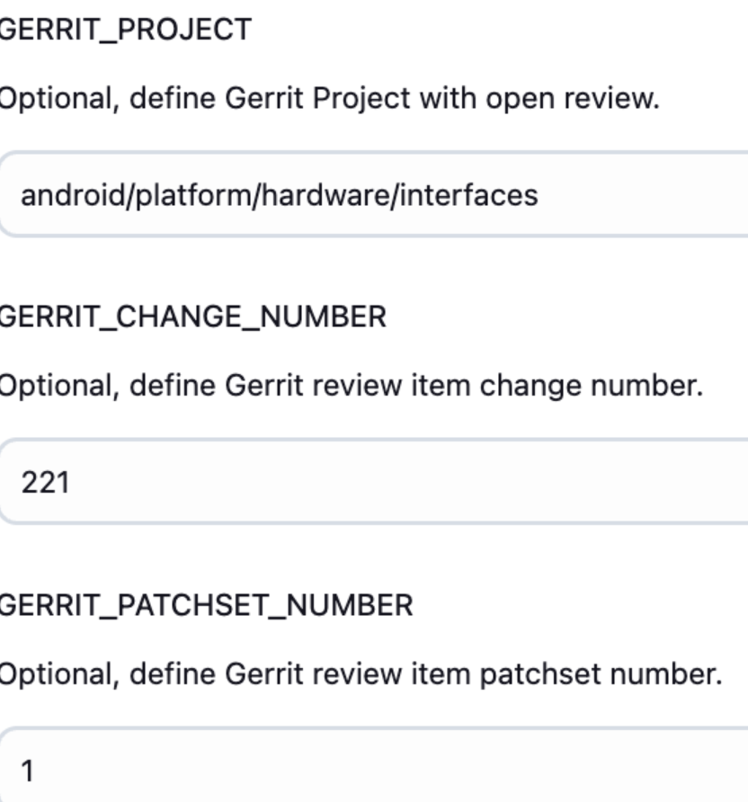
 - Select `Build`

- The build console log will show AIDL update.
- If you wish to check the property, run the target in `CVD Launcher`, use `MTK Connect` to book the device and launch `adb` to see the impact of the change and AIDL build. The example change shows the property as not supported in HAL but it recognises the property. That’s expected because it is not the purpose of this lab to provide a working HAL update, rather demonstrate the build command override.
  ```
  dumpsys car_service get-property-value 0x11101000
  INFO_HORIZON_SDV(0x11101000) not supported by HAL
  ```

___

</details><br/>

#### <span style="color:#335bff">6.2.4 Boot Animation<a id="6-2-4-boot-animation"></a></span>

**Learning Objective**

Upon completing this exercise, you will acquire practical skills in updating the default Android boot animation and evaluate on a hardware platform.

<details><summary><b>Lab Exercise</b></summary>

___

> **Note:**
> This is optional. Included if developer is interested in changing the Android Boot Animation.
>
> Refer to Google [README](https://android.googlesource.com/platform/packages/services/Car/+/refs/tags/android-16.0.0_32/car_product/car_ui_portrait/bootanimation/README) and [FORMAT.md](https://android.googlesource.com/platform/frameworks/base/+/master/cmds/bootanimation/FORMAT.md) for further details.

**_Clone Repo:_**

> **Important:**
> - URLs differ per project, so do not cut and paste from this text, copy from Gerrit only.
> - Remember to use your Horizon SDV Gerrit credentials and HTTP token/password as mentioned in earlier sections. How you manage those is entirely up to you.

- Open Gerrit (e.g. https://example.horizon-sdv.com/gerrit/) and navigate to the repositories area.
- Clone the `android/platform/packages/services/Car` repo
  - `Gerrit` → `BROWSE` → `Repositories` → `android/platform/packages/services/Car`
    - Copy the `Clone with commit-msg hook` and start clone, e.g.
    ```
     git clone "https://example.horizon-sdv.com/gerrit/android/platform/packages/services/Car" && (cd "Launcher" && mkdir -p git rev-parse --git-dir/hooks/ && curl -Lo git rev-parse --git-dir/hooks/commit-msg https://example.horizon-sdv.com/gerrit/tools/hooks/commit-msg && chmod +x git rev-parse --git-dir/hooks/commit-msg)
    ```
**_Update Boot Animation:_**

- Android Boot Animation archive can be found here:

  ```Car/car_product/bootanimations/bootanimation-832.zip```

- Android Makefile to reference the boot animation is here:

  ```Car/car_product/build/car.mk```

- Android Makefile to reference the boot animation is here for SDK/CF targets:

   ```Car/car_product/build/car_generic_system.mk```

The Android boot animation archive contains partX directories which contain the image files, and a description file, `desc.txt`.

The `desc.txt` file describes the resolution of the boot animation and the PNG files, sequence (loops / delays). e.g.

```
832 520 30. Resolution: <WIDTH> <HEIGHT> <FRAMERATE>
c 1 30 part0 <TYPE> <COUNT> <PAUSE> <PATH>
c 1 0 part1
...
```

The PNG files must be unique and sequence from `000.png` to `999.png`.

**_Create the boot animation sequence files:_**
- Create you PNG files and decide on sequence. If using a video, then use a video splitter tool to convert video to frames.
  - PNG files are named `000.png` and increment, up to `999.png`

- You may reuse the Android boot animation and simply decide to modify a few images.
- Create a new archive (only archive the `desc.txt` and `partX` directories and content), e.g.
  ```
  # Store it under Car/car_product/bootanimations/
  zip -0qry -i \*.txt \*.png \*.wav @ ../horizon-animation.zip *.txt part*
  ```
- Update the `Car/car_product/build/car.mk` makefile to use your new animation, e.g.
  (Note: for SDK and CF etc, change `Car/car_product/build/car_generic_system.mk`)
  ```
  # Boot animation
  PRODUCT_COPY_FILES += \
      packages/services/Car/car_product/bootanimations/horizon-animation.zip:system/media/bootanimation.zip
  ```
- Save, commit and push the change for review.
- Once the Gerrit builds have finished, decide on which target you wish to use in test (see next section). Retrieve from GCS bucket identified in the build archive files. 

**_Test the change:_**

Use the previous lab exercises and decide how you wish to test, e.g. Pixel Tablet or Android Emulator may be best candidates because it is not possible to view the device on MTK Connect during bootup. You may also decide to use `adb` and install the new animation to `/system/media/bootanimation.zip` on the device.

- Pixel Tablet builds the car.mk so users animation should be included.
- For SDK AVD and CF targets, consider changing the generic makefile.

</details><br/>

---

### <span style="color:#335bff">6.3 Innovation<a id="6-3-innovation"></a></span>

This part of the lab is intentionally open-ended, allowing developers to explore and experiment with the platform freely. Your goal is to:

- Investigate and learn about the platform's capabilities
- Provide valuable feedback to the broader team, helping to shape and improve the platform

Some potential areas to explore include:

- Customizing HAL properties and AIDL in the `android/platform/hardware/interfaces` project on Gerrit and including an implementation.
  - Refer to Appendix and Section 3 for examples and current r2 limitations of Gerrit.
    - Creating your own forks of AOSP upstream repos, and manifest so that you push your changes to your forked branch and may build your changes.
     - `Push` not `Push for Review`, i.e. `git push origin <BRANCH>` not `git push origin HEAD:refs/for/<BRANCH>`
  - See `AAOS Builder` job and override the `AAOS_MANIFEST_URL` and `AAOS_REVISION` to point to your manifest and branch that contains your forked repos and changes.
- Working with newer Android revisions, such as:
  - Using Horizon SDV Gerrit-supported versions
  - Building against the upstream Google AOSP Gerrit and its revisions

> [!IMPORTANT]
> Please note that while there are no version restrictions (other than those imposed by the Gerrit job), lunch targets are still subject to certain limitations. Specifically, they are restricted to the prefixes defined in the Appendix.

For more detailed information on supported workloads, refer to the OSS repository: [horizon-sdv](https://github.com/googlecloudplatform/horizon-sdv), specifically the `docs/workloads` section.

---

## <span style="color:#335bff">7. Appendix<a name="7-appendix"></a></span>

This section provides additional reference material, supporting documentation and even some suggestions for additional exercises.

### <span style="color:#335bff">7.1 Android support<a name="7-1-android-support"></a></span>

The Horizon SDV builds support any version of Android using the Google AOSP upstream manifest. To utilise, simply update the `AAOS_MANIFEST_URL` and `AAOS_REVISION` parameters within `Jenkins` → `Android Workflows` → `Builds` → `AAOS Builder` job:

- `AAOS_MANIFEST_URL` set to `https://android.googlesource.com/platform/manifest`
- `AAOS_REVISION` set to the AOSP branch name.

The default manifest used is that of the Horizon SDV Gerrit and that supports the following revisions:

- `horizon/android-14.0.0_r30`
- `horizon/android-15.0.0_r36`
- `horizon/android-16.0.0_r3`

If you wish to host additional repos, or use different versions using the default Horizon SDV manifest, then refer to section 7.3.

### <span style="color:#335bff">7.2 Lunch Targets<a name="7-2-lunch-targets"></a></span>

Builds determine their functionality (e.g. setup, build args, archives) based on the LUNCH target prefix, therefore it is important to know what is supported by prefix and wildcard:

- `sdk_car*`: SDK Virtual Device targets
- `aosp_cf*`: Cuttlefish Virtual Device targets
- `*tangorpro_car*`: Pixel Tablet platform support
  - The device binaries used are version dependent - currently `ap1a/2a/3a` and `bp1a`.
- `aosp_rpi*`: Raspberry Pi targets (based on Vanilla RPi builds)
- all else will build default `m` but can be overridden by defining it in `OVERRIDE_MAKE_COMMAND` for `AAOS Builder` job.
  - However there are no artifacts stored because the build has no knowledge as to what is expected to be stored for unsupported targets.

### <span style="color:#335bff">7.3 Gerrit<a name="7-3-gerrit"></a></span>

For those wishing to create their own forks of repositories to host in Gerrit, this section provides you the basic means to do so.

For the lab exercises,  there are already a number of AOSP repositories/projects forked:

- `platform/manifest`
  - Required for Horizon SDV default manifest URLs for Horizon SDV Gerrit.
- `platform/packages/services/Car`
  - Patched for `android-14.0.0_r30` to address audio crash: Move audio device callback behind dynamic routing
  - Provided for application and platform developer exercises.
- `platform/platform_testing`
- `platform/frameworks/native`
  - Provided for platform developer exercises.
- `platform/hardware/interfaces`
  - Provided for platform developer exercises.
- `platform/packages/apps/Car/Launcher`
  - Provided for application developer exercises.

Note: Horizon SDV added `android` as a prefix to distinguish workloads, so references when using Horizon SDV manifest must include that path prefix.

And those forks have the following branches hosted:

- `android-14.0.0_r30`
- `android-15.0.0_r36`
- `android-16.0.0_r3`

Note: Horizon SDV add `horizon` as a prefix to the branch name, e.g. `android-14.0.0_r30` becomes `horizon/android-14.0.0_r30`.

For more information, user may reference [3.4 Gerrit Setup](#3-4-gerrit-setup).

#### <span style="color:#335bff">7.3.1 Fork a project <a name="7-3-1-fork-a-project"></a></span>

<details>
<summary>Create a fork</summary>
Pick the upstream project you wish to fork and do the following (note: change the Horizon SDV Gerrit URL to suit your GCP project URL):

> **Note**
> Replace `<UPSTREAM PROJECT NAME>` with the AOSP project you wish to fork and host in Horizon SDV Gerrit
>
> Replace `<HORIZON_DOMAIN>` with the URL of the GCP project you are working in.
>
> Replace `<TAG|BRANCH>` with the name of the upstream AOSP tag or branch you wish to fork.

- Create the empty project in Horizon SDV Gerrit, refer to:
  - [3.4.3.1 Create the empty Horizon Gerrit repo(s)](#3-4-3-1-create-the-empty-horizon-gerrit-repos)

- Clone the AOSP repo:
  ```
  git clone <https://android.googlesource.com/<UPSTREAM PROJECT NAME>
  ```
- Add the Horizon SDV Gerrit remote:
  ```
  git remote add horizon https://<HORIZON_DOMAIN>/gerrit/android/<UPSTREAM PROJECT NAME>
  ```
- Create the forked branch and push to Gerrit:
  ```
  git checkout -b horizon/<TAG|BRANCH> <TAG|BRANCH>``
  git push -o skip-validation horizon horizon/<TAG|BRANCH>
  ```
</details>

#### <span style="color:#335bff">7.3.2 Update the Manifest <a name="7-3-2-update-the-manifest"></a></span>

<details>
<summary>Add fork to manifest</summary>
If the user wishes to support additional branches then they must create a new manifest fork and update the `default.xml` accordingly. In that scenario, please look at `horizon/android-14.0.0_r30` as a reference example as to what other changes must be made to support other revisions.

This example shows you how to update an existing manifest to include a new forked project for the supported branches.

- Clone the Horizon SDV Gerrit manifest
  - In Gerrit select `BROWSE` → `Repositories` → `android/platform/manifest`
  - Copy the `Clone with commit-msg hook`
  - Clone the repo, e.g:
    ```
    # Clone the manifest repo (HEAD is horizon/android-14.0.0_r30)
    git clone "https://<HORIZON_DOMAIN>/gerrit/android/platform/manifest" && (cd "manifest" && mkdir -p `git rev-parse --git-dir`/hooks/ && curl -Lo `git rev-parse --git-dir`/hooks/commit-msg https://<HORIZON_DOMAIN>/gerrit/tools/hooks/commit-msg && chmod +x `git rev-parse --git-dir`/hooks/commit-msg)
    cd manifest

- Update the manifest
  - Find the project you have forked in the `default.xml` manifest and update as follows:
    - Note: add `android` prefix to the `name` and include `remote="gerrit" revision="horizon/<TAG|BRANCH>`" replacing `<TAG|BRANCH>` to match your forked repo branch/tag.
    ```
    <project path="<PROJECT PATH>" name="android/<UPSTREAM PROJECT NAME>" groups="pdk" remote="gerrit" revision="horizon/<TAG|BRANCH>"/>
    ```
- Commit the manifest: `git commit -am "Update <TAG|BRANCH> manifest"`
  - Update commit-id: `git commit --amend --no-edit`
  - Push for review: `git push origin HEAD:refs/for/horizon/<TAG|BRANCH>`
  - Review and Submit change in Gerrit:
    - In Gerrit, select `CHANGES` → `OPEN` and click on the change or open the CLI link reported in the console after `push`.
    - Review and submit the change: `REPLY` → `CODE-REVIEW+2` → `SUBMIT` → `CONTINUE`

</details>

#### <span style="color:#335bff">7.3.3 Gerrit Triggers <a name="7-3-3-gerrit-triggers"></a></span>

If user decides to utilise more than the default set of forked branches/tags identified earlier, they must update the Gerrit Build job in the OSS repo, see `workloads/android/pipelines/builds/gerrit/Jenkinsfile` and the logic to determine the build version (e.g. `ap1a`, `ap2a` …. `bp1a`, `bp3a`). The logic is vital for the job to determine the lunch target name vs android revision.

Gerrit triggers are based on a single project/repo build, i.e. build one component change. There is currently no support for cross/multi project changes such as those identified by topic. Support for topic and multi-repo changes may be provided in the next release.

### <span style="color:#335bff">7.4 Cuttlefish Instance Templates<a name="7-4-cuttlefish-instance-templates"></a></span>

Cuttlefish instance templates are instances pre-installed with Android cuttlefish debian host packages, Android 14, 15 and 16 CTS, together with other tools required to launch CVD and run CTS tests. There are two instances we have created ahead of time:

- `cuttlefish-vm-v1350` based on [android-cuttlefish.git v1.35.0 tag](https://github.com/google/android-cuttlefish/tree/v1.35.0)
- `cuttlefish-vm-main` based on [android-cuttlefish.git main branch](https://github.com/google/android-cuttlefish/tree/main)

Users may wish to create newer versions as the android-cuttlefish repo is updated and new tagged versions appear. This section describes how to create the instance templates and configure the test jobs to use those instances.

> [!NOTE]
> Instance templates take around 1 hour to create. This is because the install of android-cuttlefish takes a significant time, together with downloading and installing Android 14, 15 and 16 CTS takes around 25 minutes. The remaining time is based on GCP gcloud CLI commands, these commands can complete before the change is actually visible, therefore there are some mandatory delays included to ensure settling time of the gcloud CLI updates.
>
> Refer to the OSS repo: [horizon-sdv](https://github.com/googlecloudplatform/horizon-sdv) `docs/workloads/environment/cf_instance_template.md` for more details.


<details><summary>Create Instance Template</summary>

___

- From Jenkins, Build `Android Workflows` → `Environment` → `CF Instance Template` as follows:
- Update `ANDROID_CUTTLEFISH_REVISION` to the version you wish to use, e.g. `v1.2.0` or `v1.3.0`

  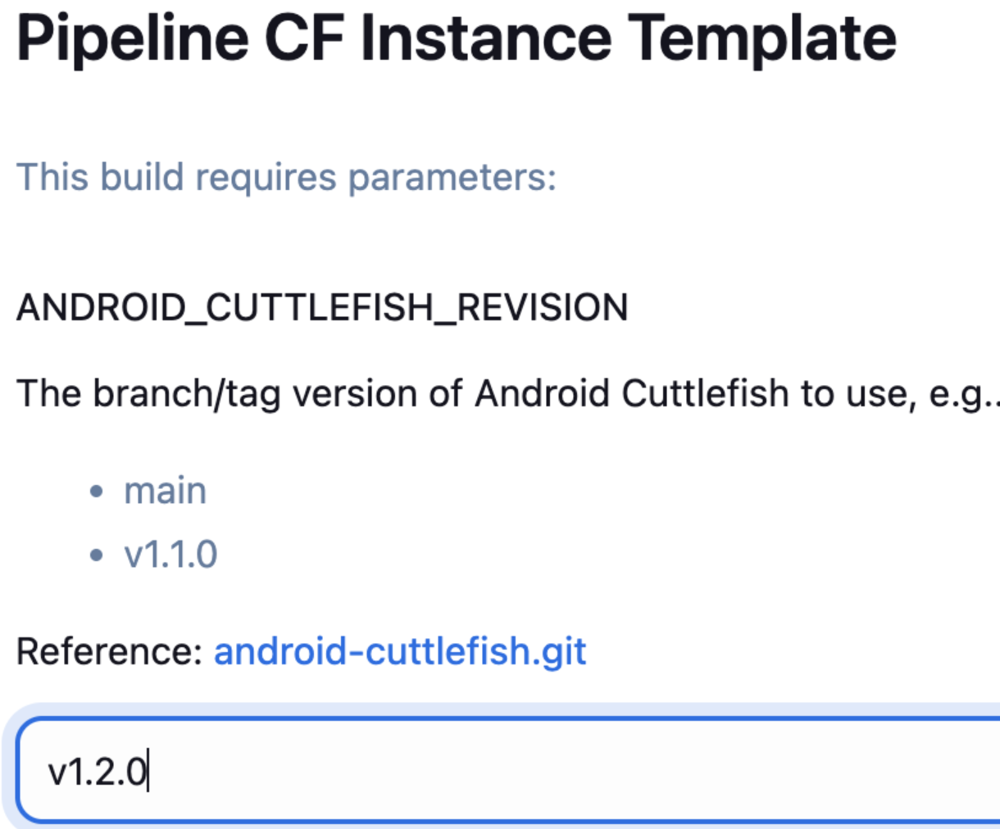

- Select `Build`

  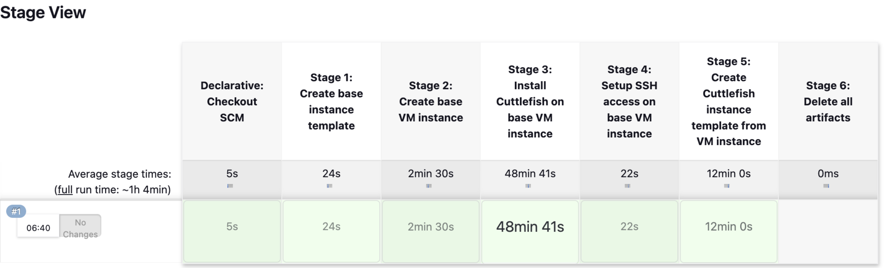

  See Note above as to why the creation takes an hour.

When built, a new instance template, e.g. `instance-template-cuttlefish-vm-v120` will have been created together with its associated disk image.

> **Note:**
> Users may create their own CF VM instance templates and even a VM instance they can start up, connect to and develop on. To do so, refer to OSS repo [horizon-sdv](https://github.com/googlecloudplatform/horizon-sdv) `docs/workloads/android/environment/cf_instance_template.md`.

___

</details><br/>

<details><summary>Create the Cloud Configuration</summary>

___

- Normally we define a new `computeEngine` entry, or replace an existing `computeEngine` entry within Jenkins CasC (`gitops/workloads/values-jenkins.yaml` in the [horizon-sdv](https://github.com/googlecloudplatform/horizon-sdv) repo) and let ArgoCD deploy the change which will create the new cloud entry in Jenkins.
- If you do not create in CasC the new cloud entry will not persist across Jenkins restarts.
- For sake of time, for this exercise we will create a new cloud entry manually in Jenkins.
  - In Jenkins navigate to `Manage Jenkins` → `Clouds` → `New Cloud`

    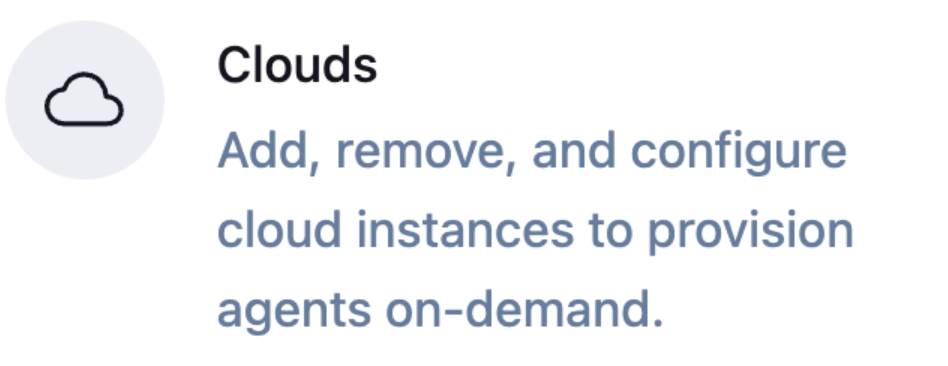

  - Create a new Cloud name (e.g. `gce-cuttlefish-vm-v120`) from a copy of an existing cloud (`gce-cuttlefish-vm-v110`)

    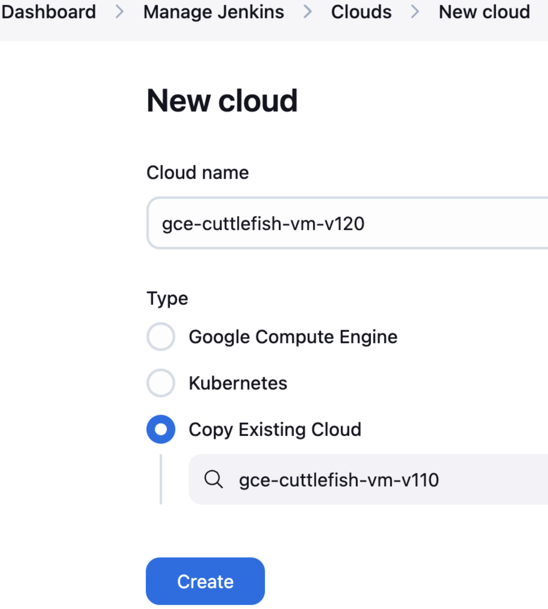

  - Select `Create`
  - Change all references (names/labels etc) from `cuttlefish-vm-v110` to `cuttlefish-vm-120`

    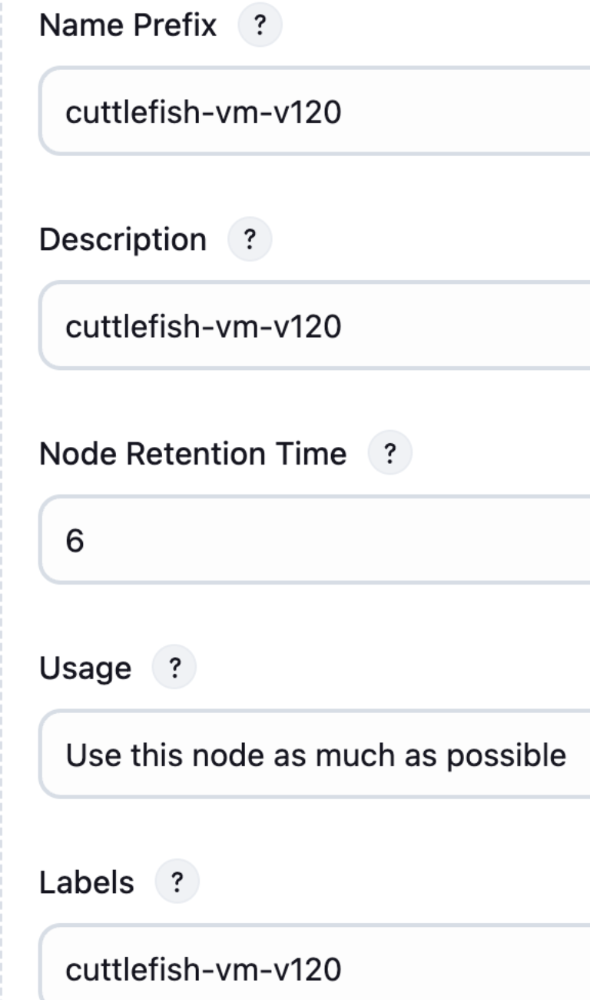

  - Update the Machine Instance to `instance-template-cuttlefish-vm-v120`

    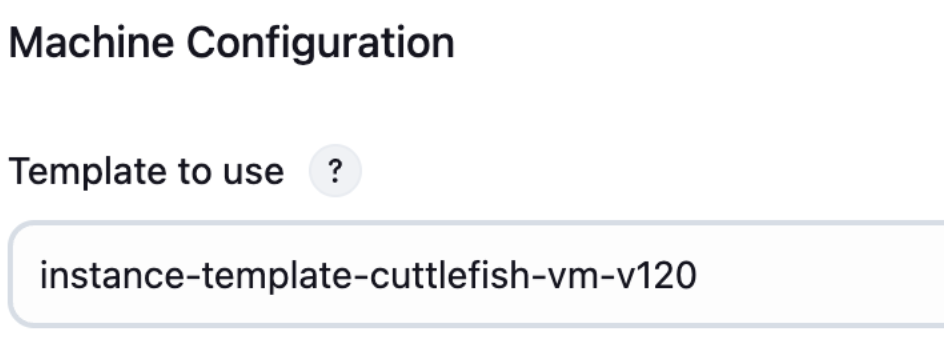

___

</details><br/>

<details><summary>Test the template</summary>

___

In Jenkins navigate to `Android Workflows` → `Tests` → `CVD Launcher` → `Build with Parameters`

  

- Set `JENKINS_GCE_CLOUD_LABEL` to the run CVD on the new instance template, label:`cuttlefish-vm-v120`
- Set `CUTTLEFISH_DOWNLOAD_URL` to pull in the host packages and images from an `aosp_cf` build from earlier lab exercises.
- Enable `CUTTLEFISH_INSTALL_WIFI`
- Update `CUTTLEFISH_KEEP_ALIVE_TIME` to a suitable time so you check the result in MTK Connect.
- Select `Build`

As per previous lab exercises, once the job transitions to the `Keep Devices Alive` stage, open MTK Connect application and book the device to verify it is correct.

You may also repeat previous `CTS Execution` exercises but using `JENKINS_GCE_CLOUD_LABEL` `cuttlefish-vm-v120`, to verify CTS running on the virtual devices within that Cuttlefish VM instance.

Feel free to experiment with `android-cuttlefish` revisions and also the CasC approach where cloud configuration is managed in `gitops/workloads/values-jenkins.yaml`.

___

</details><br/>


### <span style="color:#335bff">7.5 Machine Types <a name="7-5-machine-types"></a></span>

The table below shows the templates and machine types used for the Android workflows.

| Job Name             | [buildkit](https://hub.docker.com/r/moby/buildkit) | Docker Image Template | CF Instance Template |
| :----------------------------------------------------------------| :---------------------------------------------------: | :-------------------: | :------------------: |
| `Android Workflows / Environment / Docker Image Template`         |  ✅ |    |    |
| `Android Workflows / Environment / CF Instance Template`          |     | ✅ <sup>1</sup>|    |
| `Android Workflows / Environment / Delete Cuttlefish VM Instance` |     | ✅ <sup>1</sup>|    |
| `Android Workflows / Environment / Delete MTK Connect Testbench`  |     | ✅ <sup>1</sup>|    |
| `Android Workflows / Environment / Development Instance`          |     | ✅ <sup>2</sup>|    |
| `Android Workflows / Environment / Warm Build Caches`             |     | ✅ <sup>2</sup>|    |
| `Android Workflows / Builds / AAOS Builder`                       |     | ✅ <sup>2</sup>|    |
| `Android Workflows / Tests / CTS Execution`                       |     | ✅ <sup>1</sup>| ✅ <sup>3</sup> |
| `Android Workflows / Tests / CVD Launcher`                        |     | ✅ <sup>1</sup>| ✅ <sup>3</sup> |

<sup>1: Uses any available node: Horizon standard nodes are `n1-standard-4` shared across tools and platform.</sup><br/>
<sup>2: Uses build nodes: `c2d-highcpu-112`</sup><br/>
<sup>3: Uses test nodes: `n2-standard-32`</sup>

If users are interested in how these machine types are configured, then refer to the following within the OSS repo: [horizon-sdv](https://github.com/googlecloudplatform/horizon-sdv)

**Android Build Jobs: `c2d-highcpu-112`**
- `./terraform/env/main.tf`: `sdv_build_node_pool_machine_type   = "c2d-highcpu-112"`
- `./terraform/modules/base/variables.tf`: ` default     = "c2d-highcpu-112"`
  - Requires GitHub actions to run the Terraform workflow to apply any changes.
- Jenkinsfile `kubernetesPodTemplate` POD configuration:
  - Refer to `resources`, `limits` and `requests` in the Jenkinsfile. These are optimised to the Jenkins pipeline builds and
    need for additional resources for the Jenkins agent etc. You may adjust to your machine limits.
  - `workloads/android/pipelines/environment/warm_build_caches/Jenkinsfile`
  - `workloads/android/pipelines/environment/dev_instance/Jenkinsfile`
  - `workloads/android/pipelines/builds/aaos_builder/Jenkinsfile`

**OpenBSW Build Jobs: `n1-standard-8`**
- `./terraform/env/main.tf`: `sdv_openbsw_build_node_pool_machine_type   = "n1-standard-8"`
- `./terraform/modules/base/variables.tf`: ` default     = "n1-standard-8"`
  - Requires GitHub actions to run the Terraform workflow to apply any changes.

**Test Jobs: `n2-standard-32`**
- This is part of the `Android Workflows` → `Environment` → `CF Instance Template` configuration.
- Change `MACHINE_TYPE` parameter to the machine type you wish to use and regenerate the Instance Templates.

### <span style="color:#335bff">7.6 Standalone Build and Test Scripts<a name="7-6-standalone-build-and-test-scripts"></a></span>

Most Jenkins pipeline jobs execute scripts that can be run directly on build and CF instances, without relying on Jenkins. These scripts are available in the OSS repository: [horizon-sdv](https://github.com/googlecloudplatform/horizon-sdv). These scripts can be run indepedent of Jenkins.

You can find documented examples in the following directories:

- `docs/workloads`
- `workloads/android/pipelines/`
- Respective areas, environment, build, and test directories

The only exceptions are the `Docker Image Template` and `CF Instance Template jobs`, which must be run through Jenkins. However, running scripts directly can facilitate development and testing, allowing you to:

- Iterate faster on changes
- Test and validate scripts independently
- Simplify debugging and troubleshooting

### <span style="color:#335bff">7.7 Debugging and Extending Build and Test Jobs<a name="7-7-debugging-and-extending-build-and-test-jobs"></a></span>

When running build and test jobs from Jenkins, you have the option to extend the job and connect to the instance for debugging and further testing. This feature allows developers to:

- Investigate build and test failures in real-time
- Run additional tests or experiments
- Gather more information for debugging purposes

For more information on how to do so, please refer to the documentation in the OSS repository: [horizon-sdv](https://github.com/googlecloudplatform/horizon-sdv).

There is also a job in `Android Workflows` → `Environment` → `Development Instance` to aid with creating your own build instance and running scripts/jobs locally.

Users will require roles/permissions setup to utilise these facilities. To do so, discuss with your platform infrastructure team to set up, e.g.

- `roles/compute.instanceAdmin.v1`
- `roles/iap.tunnelResourceAccessor`
- `roles/iam.serviceAccountUser`


### <span style="color:#335bff">7.8 RPi Support<a name="7-8-rpi-support"></a></span>

The builds support Raspberry Pi targets. This is based on [Raspberry Vanilla](https://github.com/raspberry-vanilla).

- Select `Android Workflows` → `Builds` → `AAOS Builder` → `Build with Parameters` and define the following:
  - `AAOS_REVISION` `horizon/android-16.0.0_r3`
  - `AAOS_LUNCH_TARGET` `aosp_rpi5_car-bp3a-userdebug` or `aosp_rpi4_car-bp3a-userdebug`
  - Select `Build`

- The build artifacts will show where in Google cloud storage to retrieve the following files:
  - `boot.img`
  - `system.img`
  - `vendor.img`

- Download the files from GCS bucket.
- Grab the RPi5 [mkimg.sh](https://github.com/raspberry-vanilla/android_device_brcm_rpi5/blob/android-16.0/mkimg.sh) or RPi4 [mkimg.sh](https://github.com/raspberry-vanilla/android_device_brcm_rpi4/blob/android-16.0/mkimg.sh) script depending on which version you are building for. This script is used to create the flashable image.

  - Must be run on a host that supports loop devices, Horizon SDV build instances are Docker containers running in kubernetes and do not have the privileges to support loop devices. Run as follows, e.g.
  ```
  # CHANGE ANDROID_PRODUCT_OUT <path to img files> with the path to the downloaded files
  # Change TARGET_PRODUCT to match the AAOS_LUNCH_TARGET
  TARGET_PRODUCT=aosp_rpi5_car-bp3a-userdebug \
  ANDROID_PRODUCT_OUT=<path to img files> \
  ./mkimg.sh
   ```
- The `mkimg.sh` script will create the flashable image, e.g. `RaspberryVanillaAOSP15-<date>-rpi5_car-bp3a-userdebug.img`.

> [!NOTE]
> - User may wish to build from a different release, if so, use the Google AOSP manifest and updated versions, e.g.
>   - `AAOS_MANIFEST_URL` `https://android.googlesource.com/platform/manifest`
>   - `AAOS_REVISION` `android-15.0.0_r36`
>   - `AAOS_LUNCH_TARGET` `aosp_rpi5_car-bp1a-userdebug` or `aosp_rpi4_car-bp1a-userdebug`
>
> - Or build for Android 14:
>   - `AAOS_MANIFEST_URL` `https://android.googlesource.com/platform/manifest`
>   - `AAOS_REVISION` `android-14.0.0_r67`
>   - `AAOS_LUNCH_TARGET` `aosp_rpi5_car-ap2a-userdebug` or `aosp_rpi4_car-ap2a-userdebug`
>   - `POST_REPO_INITIALISE_COMMAND` `curl -o .repo/local_manifests/manifest_brcm_rpi.xml -L https://raw.githubusercontent.com/raspberry-vanilla/android_local_manifest/android-14.0/manifest_brcm_rpi.xml --create-dirs && curl -o .repo/local_manifests/remove_projects.xml -L https://raw.githubusercontent.com/raspberry-vanilla/android_local_manifest/android-14.0/remove_projects.xml`
>
> Also, Vanilla RPi updates move revisions frequently, so one week the builds may work and the next not. Keep up to date on their
> changes and use the parameters defined above to override.

> [!TIP]
> - `POST_REPO_INITIALISE_COMMAND` build parameter allows the user to override the post repo init commands, e.g. update the RPi manifest.
>   - Refer to OSS repository: [horizon-sdv](https://github.com/googlecloudplatform/horizon-sdv) `docs/workloads/android/builds/aaos_builder.md` and build scripts for more details.

---
