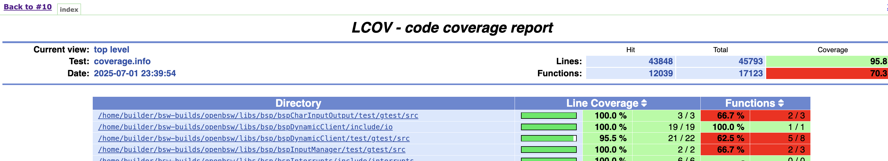
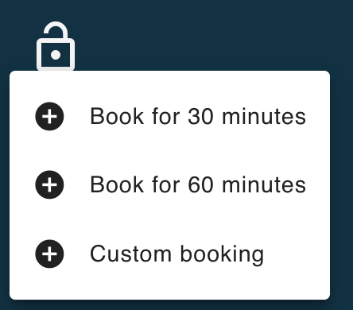
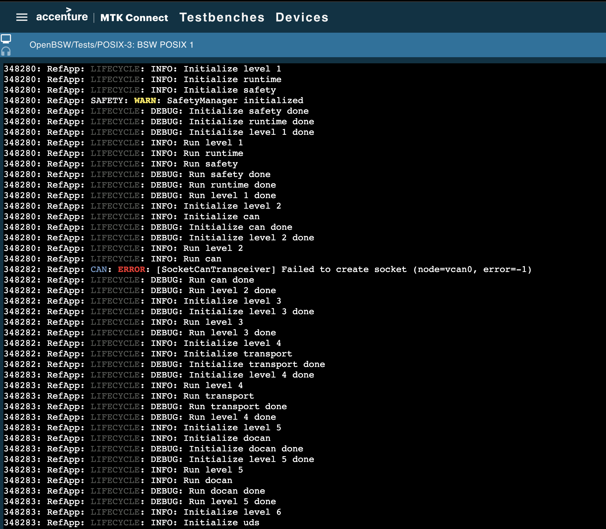

# <span style="color:#335bff">Horizon SDV OpenBSW Developer Guide</span>

## <span style="color:#335bff">1. Overview<a name="1-overview"></a></span>
This page offers a general overview of the Eclipse Foundation OpenBSW workload, which has been integrated into Horizon SDV.

The purpose of this page is to provide a high-level understanding of how to configure the workload and utilize the provided jobs to build and test OpenBSW. It is not intended to serve as a comprehensive lab exercise guide.

## <span style="color:#335bff">2. Table Of Contents <a name="2-table-of-contents"></a></span>

- [1. Overview](#1-overview)
- [2. Table Of Contents](#2-table-of-contents)
- [3. Prerequisites](#3-prerequisites)
  * [3.1 Keycloak Configuration](#3-1-keycloak-configuration)
  * [3.2 Seeding OpenBSW Workload](#3-2-openbsw-seed)
  * [3.3 Docker Image Template](#3-3-docker-image-template)
- [4. Build](#4-build)
  * [4.1 Unit Tests](#4-1-unittests)
  * [4.2 POSIX Target](#4-2-posix)
  * [4.3 S32K148 Target](#4-3-s32k148)
- [5. Test](#5-test)
  * [5.1 POSIX Target](#5-1-posix)
  * [5.2 S32K148 Target](#5-2-hardware)
- [6. Appendix](#7-appendix)
  * [6.1 Reference material](#6-1-reference)
  * [6.2 Known Limitations](#6-2-limitations)

---

## <span style="color:#335bff">3. Prerequisites <a name="3-prerequisites"></a></span>

Before either developer can utilise the Horizon SDV platform tools, several prerequisite steps must be completed.

Summary of pre-requisite tasks:
- Horizon SDV Platform Provisioned.
  - Not in scope of this guide, refer to [deployment_guide.md](../../../deployment_guide.md)
- Keycloak and Jenkins group/role access provisioned.
- Workloads seeded from Jenkins.
- Docker Image Template created from Jenkins.

### <span style="color:#335bff">3.1 Keycloak Configuration <a name="3-1-keycloak-configuration"></a></span>

This has been detailed in the following documentation, please ensure this is configured as documented.

- [Role based strategy configuration](../../guides/pipeline_guide.md#irolebasedstrategy)

### <span style="color:#335bff">3.2 Seeding OpenBSW Workload <a name="3-2-openbsw-seed"></a></span>

This has been detailed in the following documentation, please ensure this has been run as documented.

- [Seed OpenBSW Workload](../../seed.md)

### <span style="color:#335bff">3.3 Docker Image Template <a name="3-3-docker-image-template"></a></span>

**Create Container Image**

To build OpenBSW targets and utilize other pipeline jobs, you must first run the Docker Image Template job. This job creates the Docker image that Kubernetes will use to execute jobs on the build nodes.

**Running the Docker Image Template Job**

To run the Docker Image Template job, follow these steps to take the defaults:

1. Go to `Jenkins` → `OpenBSW Workflows` → `Environment`→ `Docker Image Template`
2. Deselect the `NO_PUSH` option
3. Select the `Build` option

If the user wishes to override the default tools, then choose the desired versions and update the appropriate
parameters.  If you want to change the `LINUX_DISTRIBUTION`, consider updating the `IMAGE_TAG` to include the version. You can do this globally by modifying the `IMAGE_TAG` in the `OpenBSW` section of the `Seed Workloads` job and reseeding OpenBSW workload.

**Additional Information**

For more details on the `Docker Image Template` and `Seed Workloads` jobs, refer to the following resources:

- [Docker Image Template](../environment/docker_image_template.md)
- [Seed Workloads](../../seed.md)

## <span style="color:#335bff">4. Build<a name="4-build"></a></span>

This section provides an overview of how to leverage the OpenBSW builds in Horizon SDV to:

- **Build and Run Unit Tests:** Compile and execute unit tests, including code coverage analysis.
- **Build for POSIX Target Platform:** Compile OpenBSW for the POSIX target platform.
- **Build for NXP S32K148 Platform:** Compile OpenBSW for the [NXP S23K148](https://www.nxp.com/design/design-center/development-boards-and-designs/automotive-development-platforms/s32k-mcu-platforms/s32k148-q176-evaluation-board-for-automotive-general-purpose:S32K148EVB) platform. evaluation board, a platform designed for automotive general-purpose applications.

Users have the flexibility to choose how they want to run their tests. They can either:

- Run all builds together
- Select specific tests, builds by configuring the parameters to suit their needs, allowing them to focus on specific areas of interest.

### <span style="color:#335bff">4.1  Unit Tests<a name="4-1-unittests"></a></span>

Users have multiple options for building and running Unit Tests, including:

- **Build Options:** Choose to build all tests or select a specific test to build.
- **Test Execution:** Run the unit tests to verify the functionality of the code.
- **Code Coverage:** Enable code coverage to generate detailed reports on test coverage, helping to identify areas of the code that need more testing.

### <span style="color:#335bff">4.1.1 Build Unit Tests<a name="4-1-1-unittests"></a></span>

To build unit tests, follow these steps:

1. **Navigate to Jenkins:** Go to `Jenkins` → `OpenBSW Workflows` → `Builds` → `BSW Builder` → `Build with Parameters`
2. **Enable Unit Test Build:** In the Unit Tests section, ensure that `BUILD_UNIT_TESTS` is selected.
3. **Configure Unit Test Command Line:** (Optional) Choose whether to use the default `UNIT_TESTS_CMDLINE` or update it as needed.
4. **Select Unit Tests to Build:** (Optional) Choose which unit tests to build. The `UNIT_TEST_TARGET` defaults to` all`, but you can select specific tests from the `LIST_UNIT_TESTS` generated list.
5. **Configure Additional Parameters:** (Optional) Disable any other parameters as needed. Many parameters have default values, so you may want to disable them if they're not required.
6. **Start the Build:** Select `Build` and wait for the job to complete.

### <span style="color:#335bff">4.1.2 Run Unit Tests<a name="4-1-2-unittests"></a></span>

**Running Unit Tests**

To run unit tests, repeat the steps from _4.1.1 Build Unit Tests_, but before starting the build, follow these additional steps:

1. **Enable Unit Test Execution:** Select `RUN_UNIT_TESTS`.
2. **Select the Unit Test:** (Optional) Update the `RUN_UNIT_TESTS_CMDLINE` to the appropriate test if `UNIT_TEST_TARGET` is not set to `al`l. Refer to the [BSW Builder](../builds/bsw_builder.md) documentation for instructions on configuring this parameter for individual tests.
3. **Start the Build:** Select `Build` and wait for the job to complete.

**Accessing Unit Test Results**

The unit test results will be stored as a build artifact in the Jenkins job and uploaded to a Google Cloud Storage bucket. The build will create a file named `openbsw-<BUILD_NUMBER>-artifacts.txt` that shows the location of the artifacts. For example:

```
Artifacts stored in gs://sdva-2108202401-openbsw/OpenBSW/Builds/BSW_Builder/16
Bucket URL: https://console.cloud.google.com/storage/browser/sdva-2108202401-openbsw/OpenBSW/Builds/BSW_Builder/16

    gcloud storage cp gs://sdva-2108202401-openbsw/OpenBSW/Builds/BSW_Builder/16/build_info.txt .
    gcloud storage cp gs://sdva-2108202401-openbsw/OpenBSW/Builds/BSW_Builder/16/unit_test_results.txt .
```
You can access the results from Jenkins itself or using `gcloud storage` to download.

### <span style="color:#335bff">4.1.3 Test Coverage<a name="4-1-3-unittests"></a></span>

**Enabling Code Coverage**

Repeat the steps from _4.1.2 Run Unit Tests_ but before `Start the Build` step, do the following:
1. **Enable Coverage:** In the `Unit Tests` section, enable `CODE_COVERAGE`
2. **Start the Build:** Select `Build` and wait for the job to complete.

**Accessing Coverage Results**

The coverage results will be stored as a build artifact in the Jenkins job and uploaded to a Google Cloud Storage bucket. The build will create a file named `openbsw-<BUILD_NUMBER>-artifacts.txt` that shows the location of the artifacts. For example:

```
Artifacts stored in gs://sdva-2108202401-openbsw/OpenBSW/Builds/BSW_Builder/10
Bucket URL: https://console.cloud.google.com/storage/browser/sdva-2108202401-openbsw/OpenBSW/Builds/BSW_Builder/10

    gcloud storage cp gs://sdva-2108202401-openbsw/OpenBSW/Builds/BSW_Builder/10/build_info.txt .
    gcloud storage cp gs://sdva-2108202401-openbsw/OpenBSW/Builds/BSW_Builder/10/unit_test_results.txt .
    gcloud storage cp gs://sdva-2108202401-openbsw/OpenBSW/Builds/BSW_Builder/10/coverage_unfiltered.info .
    gcloud storage cp gs://sdva-2108202401-openbsw/OpenBSW/Builds/BSW_Builder/10/coverage.info .
    gcloud storage cp gs://sdva-2108202401-openbsw/OpenBSW/Builds/BSW_Builder/10/coverage.html.tgz .
```

Jenkins has the `htmlPublisher` plugin installed, so the coverage report is also visible from `OpenBSW Unit Test
Coverage Report` menu option available on the left hand side of the build job, e.g above `Replay` and `Restart from
Stage` options:


When selected the user will be presented with the coverage report, e.g.




### <span style="color:#335bff">4.2 POSIX Target<a name="4-2-posix"></a></span>

**Building POSIX Target**
To build POSIX target, follow these steps:

1. **Navigate to Jenkins:** Go to `Jenkins` → `OpenBSW Workflows` → `Builds` → `BSW Builder` → `Build with Parameters`
2. **Enable POSIX Build:** In the `POSIX Target` section, ensure that `BUILD_POSIX` is selected.
3. **Configure POSIX Command Line:** (Optional) Choose whether to use the default `POSIX_BUILD_CMDLINE` or update it as needed.
5. **Disable Optional Parameters:** (Optional) Disable any other builds if they're not required.
6. **Start the Build:** Select `Build` and wait for the job to complete.

**Accessing POSIX Application**

The POSIX application will be uploaded to a Google Cloud Storage bucket. The build will create a file named `openbsw-<BUILD_NUMBER>-artifacts.txt` that shows the location of the artifacts. For example:

```
Artifacts stored in gs://sdva-2108202401-openbsw/OpenBSW/Builds/BSW_Builder/23
Bucket URL: https://console.cloud.google.com/storage/browser/sdva-2108202401-openbsw/OpenBSW/Builds/BSW_Builder/23

    gcloud storage cp gs://sdva-2108202401-openbsw/OpenBSW/Builds/BSW_Builder/23/build_info.txt .
    gcloud storage cp -r gs://sdva-2108202401-openbsw/OpenBSW/Builds/BSW_Builder/23/posix .
```

This storage location will be required for the POSIX tests section later in this document, e.g. `gs://sdva-2108202401-openbsw/OpenBSW/Builds/BSW_Builder/23/posix`.

**Running pyTest against POSIX Application**

See `POSIX_PYTEST`, only applicable when `POSIX_BUILD` is selected and will run the default set of python tests against the application. User may choose to run these on the host via MTK Connect, in which case refer to the description in `Jenkins` → `OpenBSW Workflows` → `Tests` → `POSIX`.

### <span style="color:#335bff">4.3 S32K148 Target<a name="4-3-s32k148"></a></span>

**Building S32K148 Target**
To build S32K148 target, follow these steps:

1. **Navigate to Jenkins:** Go to `Jenkins` → `OpenBSW Workflows` → `Builds` → `BSW Builder` → `Build with Parameters`
2. **Enable S32K148 Build:** In the `NXP Hardware Target` section, ensure that `BUILD_NXP_S32K148` is selected.
3. **Configure S32K148 Command Line:** (Optional) Choose whether to use the default `NXP_S32K148_BUILD_CMDLINE` or update it as needed.
5. **Disable Optional Parameters:** (Optional) Disable any other builds if they're not required.
6. **Start the Build:** Select `Build` and wait for the job to complete.

**Accessing S32K148 Application**

The S32K148 application will be uploaded to a Google Cloud Storage bucket. The build will create a file named `openbsw-<BUILD_NUMBER>-artifacts.txt` that shows the location of the artifacts. For example:

```
Artifacts stored in gs://sdva-2108202401-openbsw/OpenBSW/Builds/BSW_Builder/18
Bucket URL: https://console.cloud.google.com/storage/browser/sdva-2108202401-openbsw/OpenBSW/Builds/BSW_Builder/18

    gcloud storage cp gs://sdva-2108202401-openbsw/OpenBSW/Builds/BSW_Builder/18/build_info.txt .
    gcloud storage cp -r gs://sdva-2108202401-openbsw/OpenBSW/Builds/BSW_Builder/18/s32k148-gcc .
```
Within the `s32k148` storage bucket directory, the following has been stored for later retrieval and use on NXP evaluation boards:

- **Application:** `app.referenceApp.elf`
- **Map File:** `application.map`

## <span style="color:#335bff">5. Test<a name="5-test"></a></span>

This section provides an overview of how to test the OpenBSW target builds in Horizon SDV.

### <span style="color:#335bff">5.1 POSIX Target<a name="5-1-posix"></a></span>

**POSIX Platform Testing**

The testing is achieved using MTK Connect and its HOST API which will connect to the POSIX platform that the application
can be run on.

To test the previous POSIX application built in _4.2 POSIX Target_ above, follow these steps (and instructions covered
in the Jenkins job description):

1. **Navigate to Jenkins:** Go to `Jenkins` → `OpenBSW Workflows` → `Tests` → `POSIX` → `Build with Parameters`
2. **Enter POSIX bucket URL:** In `OPENBSW_DOWNLOAD_URL` put the URL you have from section _4.2 POSIX Target_, e.g.
   `gs://sdva-2108202401-openbsw/OpenBSW/Builds/BSW_Builder/23/posix`
3. **POSIX_KEEP_ALIVE_TIME:** (Optional) Refer to the [POSIX](../tests/posix.md) documentation.
4. **Start the Build:** Select `Build` and wait for the job to enter `Keep Devices Alive` stage.

**MTK Connect HOST access**

1. **Open MTK Connect Application:** The Jenkins console log provides the `MTK Connect URL`, e.g.
  ```
  2025-07-02 05:20:55.902  ====================================================================
  2025-07-02 05:20:55.902  MTK Connect Summary:
  2025-07-02 05:20:55.902  MTK Connect Test Artifact URL: gs://sdva-2108202401-openbsw/OpenBSW/Builds/BSW_Builder/1/posix/
  2025-07-02 05:20:55.902  MTK Connect URL: https://dev.horizon-sdv.com/mtk-connect
  2025-07-02 05:20:55.902  MTK Connect Testbench: OpenBSW/Tests/POSIX-3
  2025-07-02 05:20:55.902  MTK Connect Testbench User: dave.m.smith@accenture.com
  2025-07-02 05:20:55.902  ====================================================================
  ```

  - Select the link in `MTK Connect URL:` and login.

2. **Book the device:** Select `Testbenches` and book the device for a period of time.

   

   The application will then start (depending on `LAUNCH_APPLICATION_NAME` setting above).

   

    Note: The log above shows the Testbench to book, e.g. `MTK Connect Testbench: OpenBSW/Tests/POSIX-3`

3. **Test the console:**

    Refer to `Jenkins` → `OpenBSW Workflows` → `Tests` → `POSIX` description for command to use to test with application console, e.g.
    Refer to [Using the application console](https://eclipse-openbsw.github.io/openbsw/sphinx_docs/doc/learning/console/index.html).

4. **Test using pytest:**

    Refer to `Jenkins` → `OpenBSW Workflows` → `Tests` → `POSIX` description for command to use to test the application using pytest, e.g.
    `pytest target=posix`


### <span style="color:#335bff">5.2 S32K148 Target<a name="5-2-hardware"></a></span>

**NXP S32K148 Platform Testing**

Note that testing the NXP S32K148 platform is not currently supported in this release. However, users can still download the S32K148 application from a Google Cloud storage bucket.

**Downloading the S32K148 Application**

To download the application, use the following command, which will be shown in the respective `BSW Builder` jobs
artifact file, eg. `openbsw-1-artifacts.txt`:

`gcloud storage cp -r gs://sdva-2108202401-openbsw/OpenBSW/Builds/BSW_Builder/01/s32k148-gcc .`

**Flashing the Application**

After downloading the application, users can flash it to their platform using the instructions provided in the [S32 Design Studio](https://eclipse-openbsw.github.io/openbsw/sphinx_docs/doc/learning/setup/setup_s32k148_ubuntu_nxpide.html#flash-debug-and-test-serial-console-on-ubuntu-22-04) documentation.

## <span style="color:#335bff">6. Appendix<a name="7-appendix"></a></span>

### <span style="color:#335bff">6.1 Reference material<a name="6-1-reference"></a></span>

For more information on the Eclipse Foundation OpenBSW, please refer to the following reference materials:

- [Welcome to Eclipse OpenBSW](https://eclipse-openbsw.github.io/openbsw/sphinx_docs/doc/index.html)
- [Building and Running Unit Tests](https://eclipse-openbsw.github.io/openbsw/sphinx_docs/doc/learning/unit_tests/index.html)
- [Set up build environment for POSIX platform on Ubuntu 22.04](https://eclipse-openbsw.github.io/openbsw/sphinx_docs/doc/learning/setup/setup_posix_ubuntu_build.html#setup-posix-ubuntu-build)
- [Set up build for S32K148 platform on Ubuntu 22.04](https://eclipse-openbsw.github.io/openbsw/sphinx_docs/doc/learning/setup/setup_s32k148_ubuntu_build.html)
- [Using the application console](https://eclipse-openbsw.github.io/openbsw/sphinx_docs/doc/learning/console/index.html)

These resources provide further details on the Eclipse Foundation OpenBSW, including its features, functionality, and usage.

### <span style="color:#335bff">6.2 Known Limitations<a name="6-2-limitations"></a></span>

Future releases of the Eclipse Foundation OpenBSW in Horizon SDV will include additional features and functionality that are not currently available, such as:

- [S32K148 platform testing](https://eclipse-openbsw.github.io/openbsw/sphinx_docs/doc/learning/setup/setup_env_host_ubuntu.html#s32k148-platform)

These upcoming enhancements will further expand the capabilities of the OpenBSW offering, providing users with even more tools and resources to support their development needs.
